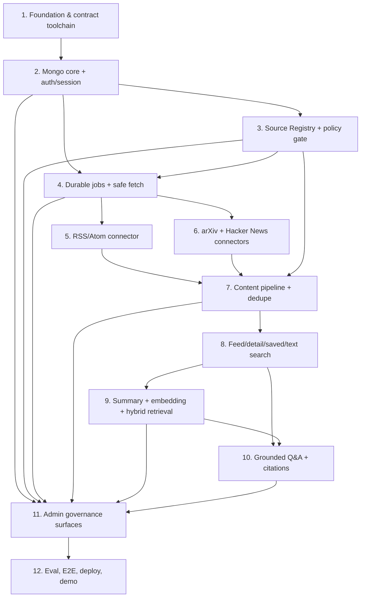

# TechPulse AI — 4-Week MVP Construction Blueprint

> Trạng thái: Plan-of-Record v1.9 — Steps 1–11 đã implement; Step 12 MVP release evidence đang được chốt; backup/restore chuyển sang hậu MVP
> Phiên bản: 1.9
> Cập nhật: 17/08/2026
> Objective: xây MVP TechPulse AI end-to-end theo solo-owner + coding-agent execution; bốn tuần là planning horizon, không phải lý do hạ safety/contract gate
> Execution mode: direct mode — git có sẵn trên `main`, `origin` đã cấu hình nhưng remote mutation không được phép nếu user chưa yêu cầu; GitHub CLI chưa cài
> Implementation baseline: JavaScript/JSX (`.js`, `.jsx`) cho React/Node.js; không dùng TypeScript/TSX trong MVP  
> Canonical product contract: [../PRD.md](../PRD.md)  
> Canonical HTTP contract: [../contracts/openapi.json](../contracts/openapi.json)

## 1. Outcome

Sau Step 12, một user có thể đăng nhập, xem feed từ RSS/Atom + arXiv + Hacker News, thấy ảnh preview được duyệt hoặc visual fallback, mở link video quan trọng, đọc summary tiếng Việt, tìm kiếm text/hybrid và hỏi AI với citation cấp đoạn. Một admin có thể quản lý source/text/media policy, theo dõi/retry job, xử lý article/index, takedown và user mà không truy cập secret. Hệ thống deploy được trên Vercel, lưu state trong MongoDB và fail-closed khi quyền hoặc evidence không đủ.

Kế hoạch không thay đổi phạm vi trong [../PRD.md](../PRD.md). Coding agent có thể tăng tốc scaffold/implementation/test generation, nhưng contract review, source evidence và release verification vẫn phải có bằng chứng. Chỉ mutation khi tiến độ thực tế trượt; không pre-cut hoặc âm thầm bỏ security, source policy, citation hay ba connector theo estimate.

## 2. Plan of record

Fresh agent bắt đầu bất kỳ step nào phải đọc theo thứ tự:

1. step tương ứng trong file này;
2. [../PRD.md](../PRD.md) cho requirement ID và acceptance gate;
3. [../TECHNICAL-DESIGN.md](../TECHNICAL-DESIGN.md) cho boundary/invariant;
4. [../DATA-MODEL.md](../DATA-MODEL.md) nếu step có persistence;
5. [../API-CONTRACT.md](../API-CONTRACT.md) và canonical OpenAPI nếu step chạm HTTP;
6. ADR liên quan trong [../adr/README.md](../adr/README.md).

Không dùng `TechPulse-AI.md` để ghi đè contract mới hơn; file đó là source quyết định/rationale gốc. Thứ tự authority:

```text
Product intent: PRD → Product Brief → TechPulse idea log
HTTP shape: OpenAPI
Persistence shape: DATA-MODEL
Architecture rationale: ADR
Execution order: blueprint này
```

## 3. Pre-flight evidence

| Check | Kết quả 09/08/2026 | Hệ quả |
|---|---|---|
| Git repository | Có, branch `main` | Có thể review diff/commit cục bộ |
| Git remote | Có `origin` fetch/push | Chỉ dùng làm checkout evidence; không suy ra quyền push/PR/deploy |
| GitHub CLI | Không cài | Direct mode; không dùng `gh` |
| Existing code/package | Chưa có | Step 1 sở hữu toàn bộ scaffold |
| Existing plan/memory | Không có | File này là execution index đầu tiên |
| ECC plugin marker | Có | Orchestration guide chỉ giữ reference chain `ecc:*`, không ghi custom command không tồn tại |
| Language marker | Đã chốt | JavaScript/JSX theo ADR-0008; Step 1 tạo `.js`/`.jsx` và `jsconfig.json` |

JavaScript/JSX là quyết định đã duyệt, không còn là assumption. Đổi sang TypeScript/TSX sau này phải tạo ADR/plan mutation và migration plan riêng; không trộn hai baseline âm thầm.

## 4. Global invariants

Mọi step phải giữ các invariant sau:

1. Chỉ article `published` từ source hiện `active` và license `permitted|metadata-only` xuất hiện ở user surface/retrieval.
2. Mọi AI input đi qua current source policy; `metadata-only` không tự nâng scope.
3. Không persist/log raw HTML, full text, token, API key, password hoặc session token rõ.
4. External content là untrusted data; provider không nhận tool và không quyết định citation URL.
5. Job/provider side effect idempotent; state bền vững không nằm trong process memory.
6. Text search/feed/detail vẫn hoạt động khi embedding hoặc LLM provider lỗi.
7. Query/document vector chỉ so khi cùng model/dimensions/version.
8. Admin role và object ownership kiểm tra server-side; mọi admin mutation có audit dùng action-specific `reasonCode`, không free-form case text.
9. HTTP implementation, generated JavaScript client/JSDoc và mock cùng dựa canonical OpenAPI.
10. Media nguồn chỉ là metadata/URL theo current `mediaPolicy`; không persist/rehost binary và media `not-analyzed` không vào AI evidence.
11. Không thêm connector, commercial feature, full-text archive hoặc claim-level citation.
12. `answered`/`refused` tuân conditional OpenAPI; citation resolve tới visible primary/editorial evidence và exact evidence-block support verdict là `supported`.
13. Job/checkpoint/article/artifact commit conditionally touch canonical resource lease với exact active owner/generation/unexpired authoritative time; lease high-water không TTL/reset và expired heartbeat không resurrect.
14. Audit không có arbitrary before/after snapshot; direct mutation + audit commit atomically.
15. Content takedown và automatic account deletion là hai workflow riêng: takedown redacts historical citation, deletion same-request recovery giữ completion flags.
16. Mọi external URL fetch/render là canonical HTTPS không credential; safe-fetch pin actual connection vào validated public IP.
17. Ingestion/AI commit match job `expectedSourcePolicyVersion` với current Source Policy/config/state hoặc discard output; ingestion mismatch không advance checkpoint.
18. Reconciliation marker mutation CAS exact source/required policy version + status/cursor; worker N không mutate marker N+1.
19. Due-work dùng queue-local priority + reserved bounded progress cho mỗi registered queue; unregistered queue không query collection.
20. Delayed user-owned write match active user + exact sessionVersion + current article/takedown lifecycle trước persistence.
21. Account deletion chỉ `completed` sau session/answer-attempt direct delete/zero-match, mọi-version user Q&A quota cleanup, closed tombstone và mọi completion flag; shared IP bucket không bị xóa.
22. Mọi rate-limit bucket có closed `subjectType`; TTL/retention không là authorization, completion evidence hoặc fencing primitive.
23. Takedown historical citation cleanup dùng indexed bounded per-document update, retry idempotently và zero-match scan; không mở transaction xuyên toàn chat corpus.
24. Browser API same-origin: exact Origin, `__Host-` cookie/clear tuple, no-store auth response; global ingress reject oversized/non-JSON/compressed/query-pollution trước repository.
25. Login/register dùng trusted Vercel IP adapter + fixed atomic bounds trước password hash/write; HMAC keyring rotation không reset quota.
26. Q&A raw question chỉ đi sau sensitive-input và Source Registry admission tới current DeepSeek `deepseek-v4-flash` route với capability `nonconfidential`; 24h idempotent attempt, credential admission domain, route/provider-domain circuits và support gate vẫn bắt buộc. Graph hiện tại không có model/provider fallback.
27. `community-signal` chỉ feed/search discovery, không đi vào Q&A evidence/citation.
28. RSS/Atom parser cấm DOCTYPE/entity/XInclude/network resolver và có wire/decoded/depth/node/field/time bounds.
29. Retention/cleanup dùng exact deadline+`_id` indexes và machine-only fixed task table; caller không truyền collection/filter/cutoff/batch.
30. Live governance signature/checkpoint không khả dụng thì terminal mutation fail closed. Backup/restore serving gate là hậu MVP.

## 5. Definition of Done cho mỗi step

Một step chỉ `done` khi:

- task và acceptance criteria của step đạt;
- test mới chứng minh happy path và failure/invariant path;
- `npm run contract:validate`, contract generation/test, lint và test liên quan không lỗi sau khi các script đó tồn tại;
- serialized response không dùng undocumented field;
- mọi HTTP operation bị thay đổi có success/error fixture và serialized response validate bằng canonical OpenAPI ngay trong step sở hữu, không chờ release gate;
- diff không sửa file ngoài ownership nếu không ghi lý do;
- tài liệu/runbook có ảnh hưởng được cập nhật;
- không còn secret/test credential hoặc generated file ngoài output path dự kiến;
- handoff ghi evidence thực, known limitation và next-step dependency.

## 6. Dependency graph



Parallel opportunities:

- Step 5 và Step 6 có thể chạy song song sau Step 4 vì sở hữu connector/fixture riêng; Step 7 là integration gate.
- Sau Step 9, phần UI/admin không chạm Q&A có thể được chuẩn bị song song với Step 10 nếu ownership file rõ; Step 11 chỉ exit sau Step 10 handoff để chạy deletion/takedown delayed-Q&A races.
- Trong solo mode, vẫn thực hiện tuần tự để giảm context switching; DAG chỉ giúp biết phần nào không phụ thuộc logic.

Critical path dự kiến: `1 → 2 → 3 → 4 → 5/6 → 7 → 8 → 9 → 10 → 11 → 12`. Step 11 tích hợp lifecycle race với Q&A trước release gate.

## 7. Four-week schedule

Đây là planning horizon cho solo owner làm cùng coding agent, không phải phép tính person-day cứng. Giữ đúng non-goals, dùng generated contract/fixtures và chạy verification cùng development. Chỉ kích hoạt mutation review khi milestone thực tế trượt; không dùng estimate ban đầu để cắt scope trước khi build.

| Tuần | Build timebox | Verification/deploy lane chạy cùng tuần | Gate cuối tuần |
|---|---|---|---|
| 1 | Steps 1–3 | Contract/runtime fixtures từ operation đầu tiên; auth/security integration | Login/RBAC + source draft/policy hoạt động |
| 2 | Step 4, Steps 5–6, bắt đầu Step 7 | Staging/local production build; duplicate/lease/SSRF suite; E2E skeleton | Ba connector chạy qua durable runner; common pipeline đã ingest fixture |
| 3 | Hoàn tất 7, Steps 8–9, bắt đầu backend Step 11 | Deploy staging sớm; retrieval eval seed; user-flow browser smoke | User content vertical slice + summary/embedding/text fallback |
| 4 | Step 10, hoàn tất 11, Step 12 final gate | Citation/refusal eval, security matrix, public deploy và runbook | Q&A + admin minimum + evidence; giữ một ngày contingency |

Step 12 không đợi đến Week 4 mới bắt đầu: contract evidence có từ Week 1, staging/E2E từ Week 2 và retrieval eval từ Week 3. Step 12 chỉ hợp nhất release evidence, chạy full matrix và quyết định go/no-go.

Hard cutline:

- cuối Day 5: Steps 1–3 phải xanh; nếu chưa, không thêm UI polish;
- cuối Day 10: Steps 4–6 và **core Step 7 = normalized candidate → policy/media gate → idempotent article upsert → dedupe/provenance → checkpoint** phải có fixture end-to-end;
- cuối Day 15: Step 8 cùng non-streaming summary/text fallback phải demo được;
- Day 16–18: Q&A vertical slice và admin operations tối thiểu;
- Day 19 dành release gate, Day 20 là contingency/local fallback.

Nếu Day 15 chưa đạt, project owner phải chọn một PRD mutation có ghi nhận; không được âm thầm bỏ source policy, ba connector, text fallback, citation/refusal hoặc backend admin authorization.

---

<a id="step-1"></a>
## Step 1 — Scaffold application and contract toolchain

**Intent:** Tạo một JavaScript/JSX modular-monolith skeleton có React/Vite, Express, test/lint/build và OpenAPI validation/JavaScript client generation. Đây là foundation duy nhất mà mọi step sau phụ thuộc.

**Dependencies:** Không có.  
**Estimate:** Timebox 1–1.5 ngày.  
**Review tier:** Architecture/contract-sensitive.  
**Primary requirements:** AUTH-007, QA-010, ADMIN-011, NFR-007..009/012..017 và PRD §10 MVP Deployment gate.
**ADRs:** 0001, 0004, 0008, 0012.

### Cold-start context

Repo hiện chỉ có docs. Architecture yêu cầu một Vercel project với static Vite build và thin `api/index.js` import cùng Express app dùng local. OpenAPI JSON đã tồn tại và là authority; generator không được network/secret access hoặc ghi ngoài `shared/generated/`.

### Ownership/output

```text
package.json, package-lock.json, jsconfig.json, vite.config.*
client/**/*.jsx, client/**/*.js, server/app.js, server/dev.js, api/index.js
shared/generated/**, scripts/contracts/**
eslint/prettier/vitest config, vercel.json, .env.example
```

### Tasks

1. Scaffold React/Vite bằng JavaScript/JSX và Express composition root bằng JavaScript; giữ entrypoint production mỏng và không tạo `.ts`/`.tsx`.
2. Pin Node/package-manager version và dependency versions; thêm `.env.example` chỉ có tên biến.
3. Historical Step-1 task applied `x-persistence`/completeness to the then-current 54 operations. Current canonical OpenAPI has 55 operations; reruns validate all 55 and do not treat the historical count as current scope. Generator rejects remote/path-traversal `$ref`; lint fails on missing/unknown classification, JSON-body missing `400|413|415` or Mongo operation missing `503`.
4. Thêm toàn bộ script name mà Steps 1–12 sẽ gọi: `contract:validate`, `contract:generate`, `contract:test`, `lint`, `test`, `test:integration`, `test:security`, `test:ui`, `test:e2e`, `eval:retrieval`, `eval:groundedness`, `eval:citations`, `db:migrate`, `db:migrate:dry-run`, `db:verify`, `build`. Script có thể chạy empty suite hợp lệ ở Step 1 nhưng không được là placeholder báo pass giả.
5. Implement common browser/ingress boundary: same-origin no-CORS default, exact Origin normalizer, `__Host-techpulse_session` serializer/clear tuple, no-store/private cache headers, 8 KiB target, 64 KiB identity-encoded JSON-only parser và flat allowlisted query parser. Repository spy phải chứng minh rejected request không đi tới handler/data layer.
6. Define config validation contract cho public origins, quota/IP HMAC keyring, separate governance-runtime signing keyring (secret env names only), offline checkpoint key IDs, provider capability/admission-domain tables và internal machine route; không implement DB/provider behavior ở Step 1.
7. Implement `GET /api/v1/health` đúng contract, request ID middleware và centralized error envelope tối thiểu.
8. Thêm contract/security tests cho health, hostile/missing Origin, CORS absence, cookie/cache tuple, Content-Length/chunked/non-JSON/compressed/query pollution/oversized ID, generated output không drift.
9. Document local start/build và Vercel entrypoint.

### Verification

```text
npm ci
npm run contract:validate
npm run contract:generate
npm run contract:test
npm run lint
npm test -- --run
npm run build
```

### Exit criteria

- Clean checkout cài/build/test được bằng commands đã ghi.
- Health response validate với OpenAPI; generated JavaScript client/schema import được ở client/server.
- Client bundle không chứa server environment variable.
- Vercel/local import cùng `server/app.js`, không duplicate Express app.
- Mọi operation đã có `x-persistence`; response completeness audit về zero và negative fixtures cho missing classification/mongo thiếu `503`/JSON thiếu `400|413|415` pass.
- Exact cookie/Origin/CORS/cache và strict target/body/query ingress tests pass; `/answers` generated client bắt buộc Idempotency-Key và hiểu `409|413|415`.
- Không handoff Step 2 nếu bất kỳ contract/security gate nào còn fail.

### Rollback

Revert toàn bộ scaffold như một change set; docs/contract không bị xóa. Không rollback bằng cách đưa TypeScript/TSX vào riêng một phần codebase.

**Out of scope:** Database, authentication, business UI, connector hoặc provider thật.

---

<a id="step-2"></a>
## Step 2 — Build MongoDB core, authentication and session authorization

**Intent:** Thiết lập persistence/index migration, account lifecycle, opaque server-side session, CSRF và RBAC để user/admin surface có security boundary thật.

**Dependencies:** Step 1.  
**Estimate:** Timebox 2 ngày.  
**Review tier:** Security-critical.  
**Primary requirements:** AUTH-001..008, USER-001, ADMIN-005..007, NFR-006/009/014/015/017. Workflow terminal AUTH-006 thuộc Step 11.
**ADRs:** 0002, 0004, 0012.

### Cold-start context

Public registration không nhận role; admin đầu tiên do seed script tạo. Cookie contract và exact Origin ingress đã được Step 1 khóa. Mongo chỉ lưu token hash; suspend/deletion tăng session version hoặc revoke session. Login/register phải lấy canonical Vercel IP qua trusted adapter, rate-limit trước password hash/write và không tin caller forwarding chain. Deleted user validator dùng closed tombstone allowlist.

### Ownership/output

```text
server/config/**, server/repositories/mongo/**
server/domain/user/**, server/application/auth/**, server/http/auth/**
server/http/middleware/{session,csrf,require-role,client-ip}.js
server/security/{hmac-keyring,hmac-lifecycle}/**, server/audit/writer/**
scripts/migrations/**, scripts/seed-admin.*
client/features/auth/**, client/features/account/**
test/integration/{mongo,auth,authorization}/**
```

### Tasks

1. Implement validated environment config, reusable serverless Mongo connection và HMAC keyring startup validation: exactly one current, tối đa hai retiring versions, unknown/retired document version fail closed; secret chỉ qua env name.
2. Tạo idempotent migrations/indexes/validators cho `users`, `sessions`, `rateLimitBuckets`, `savedArticles`, `adminAuditLogs` và append-only `hmacKeyLifecycleSnapshots`. User validator conditional reject role/preferences/moderation fields khi deleted; scopes map `login|register→ip`, `answer-*→user`, `admin-trigger→admin`, `source-test→source`; deadline/audit/lifecycle indexes đúng Data Model. `db:verify` assert definition + explain.
3. Implement register/login/logout/current-user/preferences theo OpenAPI và Step-1 cookie/Origin/CORS/cache boundary; `/me` bootstrap CSRF. Logout expire exact cookie tuple. Account-deletion route thuộc Step 11.
4. Hash password và opaque session token; TTL/revocation/session-version checks. Expose repository primitive direct-delete + zero-match mọi session theo userId để Step 11 gọi, nhưng không tạo deletion workflow ở Step 2.
5. Implement trusted client-IP adapter: production chỉ đọc platform-overwritten `x-forwarded-for`, canonicalize một public IP; local/test adapter explicit. Atomic fixed bounds login=10/15 phút và register=5/60 phút chạy trước expensive/auth writes; generic auth failure tránh enumeration.
6. Implement keyring-aware bucket access: derive all non-retired hashes, transactionally consolidate old→current without quota reset/double count; expose direct all-version user-quota delete/zero-match primitive cho Step 11. Stable env config không giữ lifecycle history: startup reconcile append-only Mongo snapshot, giữ mọi predecessor qua revision/hash-chain và enforce riêng từng `retiring→retired` bằng successor >=30 ngày + zero exact-version rate-limit/session/audit records.
7. Dùng cùng transaction-capable runtime Mongo client/credential/session cho domain mutation + audit; Step 2 custom role cấp domain privileges cần thiết nhưng chỉ insert/find trên audit và HMAC lifecycle snapshot collections, đồng thời khóa role-extension contract để Step 11 thêm suppression insert/find sau migration. Maintenance/offline credential tách riêng. Test credential thật: audit insert fail rollback domain mutation; audit/lifecycle update/delete bị deny.
8. Seed admin bằng explicit deployment script; không có role mutation API.
9. Tạo React auth/account state không lưu session/CSRF token trong `localStorage`; reload gọi `/me` để bootstrap token session-bound vào memory mà không revoke token hợp lệ ở tab/StrictMode request đồng thời.
10. Viết integration/security tests cho exact cookie/cache/Origin/CORS, role injection, session expiry/revoke/delete, concurrent register/login 429+Retry-After, spoofed forwarding headers, rejected register no user/session, scope/subject mismatch, old-key rotation/consolidation, CSRF, suspended/cross-user và deleted-user validator.
11. Validate serialized success/error responses của auth/account operations bằng OpenAPI fixtures.

### Verification

```text
npm run contract:validate
npm run contract:test -- auth account
npm run db:migrate -- --to auth-core
npm run db:verify -- auth-core
npm run lint
npm test -- --run auth
npm run test:integration -- auth authorization mongo
```

### Exit criteria

- Login → cookie session → `/me` hoạt động; logout/suspend làm request kế tiếp `401`.
- Reload với cookie hợp lệ lấy lại CSRF token qua `/me`; mutation thiếu/sai token vẫn bị chặn.
- User nhận `403` ở admin probe; unauthenticated nhận `401`.
- Database/log scan không có password/token/session rõ.
- Seed admin idempotent và không in credential.
- Session/quota retention/index/mapping được verify cùng migration; không có route/cleanup nào broad-delete IP bucket theo user.
- Fixed login/register bounds chạy trước password hash/write; caller-controlled forwarding headers không thay đổi canonical bucket.
- HMAC old-version fixture không reset quota; all-version deletion primitive zero-match; startup reject invalid keyring và config không thể quên predecessor đã có trong durable lifecycle history.
- Raw deleted-user fixture có role/preferences/suspension context bị validator reject; same-session audit insert failure rollback mutation và runtime role không arbitrary update/delete audit.

### Rollback

Revert auth routes/repositories và drop chỉ indexes/seed data do migration step này tạo trên demo database bằng documented rollback; không xóa database khác.

**Out of scope:** Source Registry, content, social login, password reset, MFA, multi-admin RBAC.

---

<a id="step-3"></a>
## Step 3 — Implement Source Registry and executable rights policy

**Intent:** Cho admin khai báo nguồn/publisher/evidence/scope, review quyền và activate/pause theo state machine; tạo policy gate dùng chung trước mọi AI/storage action.

**Dependencies:** Step 2.  
**Estimate:** Timebox 1.5 ngày.  
**Review tier:** Policy/security-sensitive.  
**Primary requirements:** SRC-001, SRC-003..012, ADMIN-006..008, NFR-010/011/013.
**ADRs:** 0006, 0009.

### Cold-start context

Technical check sẽ hoàn thiện ở Step 4 nhưng source CRUD/review/policy invariant phải tồn tại trước. Không rõ quyền mặc định `metadata-only`; media mặc định `none`; `review-needed|blocked` không active/ingest. Text rights, media display và operational state độc lập. AI có thể hỗ trợ đọc Terms trong tương lai nhưng không phê duyệt.

### Ownership/output

```text
server/domain/source/**, server/application/sources/**
server/repositories/mongo/source-repository.*
server/http/admin/sources/**, server/domain/policy/**
client/features/admin/sources/**
scripts/migrations/*sources*.*
scripts/seed-sources.*
tests/{unit,integration}/sources/**
```

### Tasks

1. Implement source schema/index/state transition, connector/access/authority discriminated validation và PRD Source Policy compatibility matrix ở request/domain/Mongo validators.
2. Implement admin list/create/read/update, policy-review và re-review operations đúng OpenAPI; reviewer/time do server sở hữu.
3. Implement pure content/media policy gates trả allowed fields/mode/host hoặc structured rejection; connector/provider không được tự nâng scope.
4. Enforce activation prerequisites, policyVersion increment và fail-closed current-policy lookup; re-review atomically ghi `reconciliation.status=pending` + required policy version trên source, không phụ thuộc `indexingJobs` chưa tồn tại. Marker validator enforce terminal timestamp/version/error shape; runtime enforce completed version bằng required version.
5. Ghi safe structured audit (`changedFields` + allowlisted state transition + action-specific `reasonCode`/result) trong cùng transaction với direct source mutation; không snapshot document hoặc free-form admin note.
6. Xây admin Sources UI cho draft/config/review/activate/pause, không hiển thị credential.
7. Seed source definitions ở `draft`; không seed `permitted` nếu chưa có evidence.
8. Test mọi state transition và matrix `licenseStatus × llmInputScope × storageScope`, connector mismatch/HN authority, Source request/response attribution `true + missing|null|empty`, reconciliation terminal-state invalid fixtures, cùng `imageMode/videoMode × canonical public allowedHosts`; IP literal/private/single-label host bị reject. Re-review và ordinary ingestion-affecting connector-config mutation đều phải tăng đúng một `policyVersion`, persist pending marker version mới và commit safe audit cùng transaction.
9. Validate serialized success/error responses của Source Registry operations bằng OpenAPI fixtures.

### Verification

```text
npm run contract:validate
npm run contract:test -- admin-sources
npm run db:migrate -- --to sources
npm run db:verify -- sources
npm test -- --run source policy
npm run test:integration -- sources audit
```

### Exit criteria

- Source thiếu evidence không thể activate là permitted.
- `review-needed|blocked|none` bị policy gate chặn đúng purpose.
- Media policy mặc định tắt; mode/host không được duyệt không tạo `leadMedia`.
- Admin UI/API không expose secret và user luôn `403`.
- Mọi direct mutation chỉ commit cùng safe audit record; contract không có arbitrary object.
- Connector config mutation tăng đúng một policy version và marker/audit không drift; Step 7 có thể dùng guarantee này để fence late candidate.

### Rollback

Pause mọi source được tạo bởi step, revert route/UI, giữ evidence export cho audit. Không hard-delete source/article history như một rollback kỹ thuật.

**Out of scope:** Network fetch/technical check thật, ingestion job, automatic license interpretation.

---

<a id="step-4"></a>
## Step 4 — Add durable jobs, Mongo leases and SSRF-safe source fetching

**Intent:** Xây execution substrate dùng chung cho cron/admin: job idempotent, lease/checkpoint/retry và bounded network fetch; hoàn tất source technical check.

**Dependencies:** Steps 2–3.  
**Estimate:** Timebox 2 ngày.  
**Review tier:** Architecture/security-critical.  
**Primary requirements:** SRC-002/007, ING-002..006/009..013, ADMIN-002/011, ART-008, NFR-001/005/006/012/014/017.
**ADRs:** 0001, 0002, 0003, 0006, 0010, 0011, 0012.

### Cold-start context

Vercel không giữ process/queue memory. Protected `GET /api/internal/cron/due-work` consume bounded daily continuation pages (mỗi trang tối đa 100 source, có page cap và absolute deadline) rồi gọi shared coordinator; nếu còn `hasMore`, durable cursor cho phép invocation sau tiếp tục mà không starve source vượt trang đầu. Admin POST trigger chỉ gọi shared coordinator sau intent riêng, không materialize cron jobs ngoài request. `jobLeases` giữ persistent `generationHighWater` và nullable active owner, không TTL; expired ownership phải recovery trước reacquire. Lease keys derive server-side từ ADR-0011 canonical resource table. Step 4 cung cấp queue registry + two recovery strategies để Step 9/11 đăng ký, và fairness chọn trong từng queue trước khi spill. URL admin nhập vẫn untrusted: HTTPS/no credential, validate toàn bộ A/AAAA theo một absolute deadline, reject mixed/private/link-local/mapped, pin actual connection và tự xử lý mỗi redirect.

### Ownership/output

```text
server/domain/jobs/**, server/application/jobs/**, server/jobs/**
server/repositories/mongo/{job,lease}-repository.*
server/jobs/{queue-registry,due-work-coordinator,recovery-strategies}.*
server/infrastructure/http/safe-fetch.*
server/http/admin/ingestion-jobs/**
server/http/internal/{cron,maintenance}/**, server/maintenance/{task-registry,runner}.*
server/http/admin/source-technical-checks/**
client/features/admin/jobs/**
tests/{unit,integration}/jobs/**, tests/security/ssrf/**
```

### Tasks

1. Implement generic runner/lease primitives, queue adapter/registration contract và idempotent migrations cho `ingestionJobs`/`jobLeases`/`ingestionScheduleProgress`. Daily cron materialization dùng server-owned per-period keyset cursor, mỗi call <=100 source; production cron boundedly consume continuation pages trong một invocation bằng page cap + deadline, và CAS completion/cursor an toàn khi replay/concurrency. Add normal index `status+priority+availableAt+createdAt+_id`, aged index `status+agingEligibleAt+availableAt+createdAt+_id`, deadline index `purgeAfter+_id`; lock 14/30-day retention, immutable `agingEligibleAt=createdAt+30 phút` và `idempotencyExpiresAt>=14 ngày`. `db:verify` explain phải không COLLSCAN/blocking sort.
2. Implement persistent lease acquire/heartbeat/release theo ADR-0010/0011: canonical keys only; exact owner/generation/unexpired heartbeat; expired lease không resurrect. Ingestion/indexing recovery terminal parent + tối đa một deterministic linked retry; generic contract còn cho Step 11 đăng ký same-request recovery. Mọi job/checkpoint/article/artifact write transactionally touch exact unexpired fence.
3. Implement idempotency identity `(actorScope, key, canonicalRequestHash)` cho cron/manual/retry; manual create/retry transactionally resolve exact replay trước admission, reserve đúng một quota slot rồi insert job + audit; same intent reuse logical job, mismatched hash trả `409`, cleanup không purge trước public 14-day window.
4. Implement exact two-lane due selector: aged `agingEligibleAt→availableAt→createdAt→_id` trước, normal `priority desc→availableAt→createdAt→_id`; rồi reserved one-per-queue và spill. Validate `maxJobs>=registeredQueueCount`, thiếu budget fail safe/no spill.
5. Implement SSRF-safe fetch adapter: HTTPS/no credential, validate mọi A/AAAA trong cùng absolute deadline, pin Host/SNI, manual redirects; enforce wire<=1 MiB, decoded<=4 MiB, ratio<=20 và allowlisted response content type trước connector. Không lưu sample body.
6. Implement protected due-work route và fixed-enum maintenance route substrate đúng OpenAPI. Maintenance machine bearer only, max batch 100, server-derived now/predicate/cursor; caller không gửi collection/filter/cutoff/batch. Step 4 registers ingestion cleanup; Steps 9/10/11 register owned fixed tasks.
7. Xây minimal job list/detail/retry/cancel UI.
8. Test duplicate/window/hash conflict, canonical lease/fencing/recovery; normal/aged index explain, equal-deadline `_id` pagination và no blocking sort. Three fake queues/maxJobs=3 reserved proof, low-budget fail-safe, unregistered no-query. Test machine-only fixed maintenance scope, caller filter rejection, wire/decoded/ratio limit, DNS rebinding/mixed/mapped/redirect private và oversized response.
9. Validate serialized success/error responses của cron/source-check/job operations bằng OpenAPI fixtures.

### Verification

```text
npm run contract:validate
npm run contract:test -- source-check ingestion-jobs cron
npm run db:migrate -- --to durable-jobs
npm run db:verify -- durable-jobs
npm test -- --run jobs safe-fetch
npm run test:integration -- jobs leases cron
npm run test:security -- ssrf
```

### Exit criteria

- Hai invocation cùng actor/key/hash trả cùng logical job; key với hash khác trả conflict và không double side effect.
- Chỉ exact unexpired active owner/generation commit được; release/recovery không xóa high-water và stale worker không ghi checkpoint/article/artifact sau reacquire.
- Cron/manual/retry cùng logical target dùng canonical shared key; expired heartbeat không làm lease sống lại.
- Mỗi registered due queue tiến triển hữu hạn khi queue khác backlog liên tục; unregistered indexing/deletion trước handoff không bị query và trả zero counters.
- Three-adapter unit proof không vacuous: với `maxJobs=3` và ba queue due, mỗi adapter được đúng một reserved attempt trước spill.
- Technical check không thể truy cập localhost/private/link-local/mapped private qua direct, mixed DNS, rebinding hoặc redirect URL; actual socket dùng IP đã validate.
- Wire/decoded/expansion limits abort boundedly; maintenance browser/admin auth và caller predicate bị reject; ingestion retention query dùng deadline index.
- Cron GET dùng bearer riêng; admin cookie không gọi internal route và ngược lại; response có đúng ba queue summaries và queued due work được dequeue theo budget.

### Rollback

Disable cron route/config trước, pause sources, chờ/recover running leases, rồi revert worker code. Giữ job/audit records để chẩn đoán.

**Out of scope:** Connector parse và article persistence.

---

<a id="step-5"></a>
## Step 5 — Implement the RSS/Atom connector

**Intent:** Parse nhiều RSS/Atom feed allowlisted qua common connector interface, giữ provenance và trả normalized candidates mà không tự fetch linked full article.

**Dependencies:** Step 4.  
**Estimate:** Timebox 0.75–1 ngày.  
**Review tier:** Default implementation + JavaScript/code review.  
**Primary requirements:** ING-001/006/007/009/013, SRC-006/007/009, ART-007.
**ADRs:** 0003, 0006, 0009.

### Cold-start context

RSS/Atom access không phải full-text/media license. Connector chỉ dùng field feed nằm trong source scope, áp timeout/size/rate limit, và coi markup/text/URL là untrusted. Nó có thể trả media candidate metadata từ field feed chính thức nhưng không download/probe binary, không tự quyết định quyền hiển thị và không gọi provider.

### Ownership/output

```text
server/connectors/rss/**
tests/fixtures/rss/**
tests/connectors/rss/**
```

Không sửa composition/registry chung ngoài một integration hook nhỏ đã định nghĩa ở Step 4; nếu chạy song song Step 6, Step 7 sở hữu final registry merge.

### Tasks

1. Implement connector interface for RSS 2.0/Atom với conditional metadata nếu feed hỗ trợ.
2. Normalize external ID, title, URL, author, date, language, official excerpt, retrieval timestamp và optional media candidate URL/type/alt/credit từ field feed đã allowlist.
3. Dùng XML parser no-network và reject `DOCTYPE`, external general/parameter entity, XInclude/entity expansion. Enforce depth<=64, node<=20.000, item<=100, field<=20.000 chars, parse deadline 2 giây; retry only mapped transient errors.
4. Preserve source/external provenance và distinguish missing field from empty field.
5. Add fixtures cho valid RSS/Atom, namespace variation, malformed XML, XXE/parameter entity/XInclude/recursive expansion/extreme nesting, duplicate IDs, unsafe URL và missing dates; assert zero secondary DNS/network calls.
6. Contract test output normalized candidate, không raw HTML/full article/media binary; media URL không HTTPS hoặc không thuộc field cho phép bị loại.

### Verification

```text
npm test -- --run connectors/rss
npm run lint
```

### Exit criteria

- RSS và Atom fixtures normalize cùng schema.
- Malformed/oversized/entity/decompression feed fail `source_payload_rejected`, bounded time/memory, zero secondary network và không crash batch.
- Connector không gọi LLM/embedding hoặc fetch article URL.
- Connector không fetch media URL; quyền/mode/host được policy gate ở Step 7 quyết định.

### Rollback

Unregister RSS connector và pause RSS sources; không sửa/xóa article đã ingest ngoài explicit cleanup script có dry-run.

**Out of scope:** Arbitrary webpage scraping, full-text extraction, feed discovery crawler, media download/proxy.

---

<a id="step-6"></a>
## Step 6 — Implement arXiv and Hacker News connectors

**Intent:** Dùng API chính thức để ingest arXiv query và ba Hacker News stream qua cùng candidate contract; gắn đúng authority/provenance semantics.

**Dependencies:** Step 4.  
**Estimate:** Timebox 1 ngày.  
**Review tier:** Default implementation + JavaScript/code review.  
**Primary requirements:** ING-001/006/007, ART-001, SRC-006/007, QA-011.
**ADRs:** 0003, 0006.

### Cold-start context

arXiv abstract/license ở cấp paper; full text không được suy diễn là allowed. Hacker News là `community-signal`; HN item/link không cấp quyền dùng linked article và tuyệt đối không eligible cho Q&A evidence/citation trong MVP. Connector không fetch linked website.

### Ownership/output

```text
server/connectors/arxiv/**
server/connectors/hacker-news/**
tests/fixtures/{arxiv,hacker-news}/**
tests/connectors/{arxiv,hacker-news}/**
```

### Tasks

1. Implement arXiv query pagination/batch, rate etiquette, ID/version normalization, authors/date/abstract/license metadata.
2. Implement HN top/new/best stream item lookup với bounded concurrency, missing/deleted item handling và linked URL preservation.
3. Map arXiv authority theo source config; hard-code HN output tier `community-signal` và emit classification fixture cho Step 9/10 evidence filter.
4. Map timeout/429/5xx retryable; invalid payload/permanent missing item không retry vô hạn.
5. Add deterministic fixtures, provider-free tests và no-linked-page-fetch assertion.
6. Expose connector metrics/counters without storing response body.

### Verification

```text
npm test -- --run connectors/arxiv connectors/hacker-news
npm run lint
```

### Exit criteria

- Ba query arXiv và top/new/best stream cấu hình được không đổi core logic.
- HN candidate luôn `community-signal` và không tự biến linked site thành permitted source.
- HN vẫn available cho permitted feed/search; downstream Q&A evidence filter nhận đúng tier để loại.
- Connector output cùng normalized candidate contract với RSS.

### Rollback

Unregister failing connector và pause source definitions tương ứng; connectors độc lập nên rollback không ảnh hưởng RSS.

**Out of scope:** arXiv PDF parsing, HN comment ingestion, linked-site scraping.

---

<a id="step-7"></a>
## Step 7 — Integrate normalization, deduplication and article lifecycle

**Intent:** Nối ba connector vào pipeline article idempotent, canonicalize/dedupe/provenance và publish/review state đúng policy.

**Dependencies:** Steps 3–6.  
**Estimate:** Timebox 1.5–2 ngày.  
**Review tier:** Architecture/data-integrity review.  
**Primary requirements:** ING-001/003/004/007/008/011, ART-001/002/005..007, SRC-009, NFR-001/011.
**ADRs:** 0002, 0003, 0006, 0009, 0010, 0011.

### Cold-start context

Connector output là candidate, không phải article trusted. Dedupe chắc chắn bằng source/external ID/canonical URL/hash; near-title/semantic ambiguity phải `review-needed`, không auto-merge. Rights/media snapshot phục vụ audit nhưng current source state/policy mới quyết định visibility. Media candidate chỉ là URL metadata và tuyệt đối không phải evidence đã phân tích.

### Ownership/output

```text
server/domain/article/**, server/application/ingestion/**
server/repositories/mongo/article-repository.*
server/connectors/registry.*
scripts/migrations/*article*
tests/{unit,integration}/articles/**, tests/integration/ingestion/**
```

### Tasks

1. Implement normalized candidate → article mapper, URL/time/language/topic normalization, allowed excerpt sanitization và media policy gate cho optional `leadMedia`.
2. Create/apply/verify article indexes/validators bằng versioned migration và shared current-source visibility predicate; rollback/dry-run target theo exact migration/job/source.
3. Implement layered dedupe, stable dedupe key, union provenance và ambiguous review flow.
4. Integrate connector runner → upsert → counters/checkpoint without duplicate side effect. Job capture `expectedSourcePolicyVersion` trước fetch; final transaction conditionally touch canonical lease và exact source ID/version/active/eligible/connector config trước article/checkpoint write. CAS miss discard candidate, không advance counter/checkpoint.
5. Set summary/embedding pending states, rights/media policy snapshot/version and publish/review decision; không fetch/persist media binary.
6. Implement hide/restore/merge domain operations and durable visibility-reconciliation intent/marker handling; artifact `removed` unsets content/model/hash/error fields. Step 7 không materialize source-marker jobs hoặc checkpoint marker; Step 9 là sole owner của fan-out/completion.
7. Test rerun same batch, cross-source canonical duplicate, conflicting metadata, source blocked/policy/config changed mid-fetch → no article/checkpoint advance, removed-artifact no-leak, allowed/blocked media host/mode và crash-before-checkpoint recovery. Fixture connector-config mutation từ Step 3 phải tăng policy version/marker/audit trước khi late candidate bị fence.

### Verification

```text
npm test -- --run article dedupe normalization
npm run db:migrate -- --to articles
npm run db:verify -- articles
npm run test:integration -- ingestion visibility idempotency
```

### Exit criteria

- Cả ba fixture connector đi qua common pipeline vào MongoDB.
- Re-run không tăng logical article/save/provenance sai.
- Chỉ valid article published; ambiguous case vào review.
- Source policy đổi fail-closed ở query/pipeline dù reconciliation chưa xong.
- Late ingestion candidate không commit nếu expected source policy/config/state đã đổi; checkpoint/counter giữ nguyên.
- `leadMedia` chỉ giữ HTTPS metadata đã qua current policy; video luôn link-only và `not-analyzed`; database không có binary/base64.

### Rollback

Pause production source và disable runner trước. Revert mapper/repository; dùng dry-run cleanup theo `jobId/sourceId` nếu dữ liệu demo do bug tạo, không broad-delete collection.

**Out of scope:** AI summary, embedding, source reconciliation job materialization/checkpoint completion, user feed UI.

---

<a id="step-8"></a>
## Step 8 — Deliver feed, detail, saved articles and keyword search

**Intent:** Hoàn thành user content vertical slice dùng được khi mọi AI provider tắt: feed/filter/detail/original source/saved/text search.

**Dependencies:** Steps 2 and 7.  
**Estimate:** Timebox 1.5 ngày.  
**Review tier:** Product/frontend + authorization review.  
**Primary requirements:** USER-002..004, ART-002..004/007/008, SEARCH-001/002/006, AI-006/007, NFR-002/007/011.
**ADRs:** 0004, 0005, 0009.

### Cold-start context

User query luôn lọc article/source visibility. Cursor dựa `(publishedAt,id)` và opaque với client. Detail không hiển thị full article; `leadMedia` nullable chỉ được serialize theo current media policy. Mọi source/citation/media URL là canonical HTTPS không credential; external anchor dùng `rel="noopener noreferrer external"`. Ảnh dùng remote-preview/fallback, video link-only với disclosure AI chưa phân tích. CTA nguồn nổi bật và summary có thể pending/null. Saved relation thuộc user và operation idempotent.

### Ownership/output

```text
server/application/{articles,search,saved}/**
server/http/{articles,search,saved}/**
client/features/{feed,article-detail,saved,search}/**
client/components/citation/**
tests/{integration,ui}/content/**
```

### Tasks

1. Implement article list/detail, saved list/save/unsave/clear và text search operations đúng OpenAPI.
2. Apply shared visibility/ownership predicate ở mọi query, kể cả saved result.
3. Build responsive accessible feed/filter/search/detail/saved UI bằng generated JavaScript client/JSDoc contract.
4. Render original title/source/date/language/summary basis/AI label và prominent original-link CTA chỉ từ contract `HttpsUrl`; không bind model/source raw string trực tiếp vào `href`.
5. Render allowed image remote-preview với alt/credit/lazy loading; render TechPulse-owned fallback khi null/error; video chỉ là source link với `AI chưa phân tích video này`.
6. Handle empty/loading/error/pending-summary/unavailable-saved states; public DTO chỉ nhận summary status pending/processing/ready/failed và chỉ render text khi `ready`.
7. Add cursor consistency, removed-summary no-leak, cross-user authorization, media-policy/fallback, safe external-anchor và negative `javascript:|data:|file:|credential` URL tests.
8. Validate serialized success/error/empty/media-null responses của article/search/saved operations bằng OpenAPI fixtures.

### Verification

```text
npm run contract:validate
npm run contract:test -- articles search saved
npm test -- --run content search saved
npm run test:integration -- visibility ownership pagination
npm run test:ui -- feed detail search saved
```

### Exit criteria

- User hoàn thành login → feed → filter/search → detail → original source.
- Text search hoạt động khi embedding/LLM adapter bị disable.
- Hidden/removed/review article hoặc blocked source không leak qua feed/detail/search/saved.
- Media ngoài policy không được serialize; image failure dùng fallback, video không render iframe/player và mang `not-analyzed`.
- Core flow keyboard/focus/label cơ bản đạt.

### Rollback

Revert user routes/UI theo module; article data/pipeline giữ nguyên. Nếu cursor bug, tạm hạ limit nhưng không đổi response contract âm thầm.

**Out of scope:** Semantic ranking, AI Q&A, personalization/recommendation.

---

<a id="step-9"></a>
## Step 9 — Add Vietnamese summaries, embeddings and hybrid retrieval

**Intent:** Tạo generated summary/title tiếng Việt và compatibility-pinned vectors từ allowed fields, có model/version/hash, fallback text và admin retry/index state.

**Dependencies:** Steps 3, 4, 7 and 8.  
**Estimate:** Timebox 2 ngày.  
**Review tier:** AI/policy/data-integrity review.  
**Primary requirements:** SEARCH-003..006, AI-001..005/007..010, QA-011, ADMIN-003/011, NFR-003/005/008/009/011/012/014/016/017.
**ADRs:** 0005, 0006, 0008, 0009, 0010, 0011, 0012, 0013.

### Cold-start context

AI routes chỉ đổi qua server-owned config graph theo ADR-0013. Graph tách installed adapter, provider failure domain, credential admission domain, route và workload policy. Current graph dùng DeepSeek `deepseek-v4-flash` cho summary, `qa-generation` và `qa-support`, với credential reference `DEEPSEEK_API_KEY`; Q&A capability là `nonconfidential` và không có model/provider fallback. Raw user question chỉ được admit sau sensitive-input và Source Registry gate. Routes cùng credential tranh aggregate concurrency/budget; circuit có cả route và provider-domain scope. Embedding pin bằng `artifactCompatibilityId`; vector space khác cần version cutover + full re-index. Input/log không có field ngoài scope hoặc media `not-analyzed`.

### Ownership/output

```text
server/providers/{llm,embedding}/**
server/providers/{capability-registry,admission-router,support-verifier}/**
server/application/{summaries,embeddings,retrieval}/**
server/domain/ai-policy/**
server/repositories/mongo/provider-admission-repository.*
server/jobs/indexing/**
server/http/admin/indexing-jobs/**
scripts/migrations/{*indexing-jobs*,*provider-admission*}
client/features/article-detail/summary-state.*
client/features/admin/jobs/indexing/**
tests/{unit,integration,eval}/ai/**
```

### Tasks

1. Implement/apply/verify `indexingJobs` schema trên generic runner: normal/aged/deadline indexes + `_id`, 14-day idempotency window, 14/30-day purge, canonical fence và expected policy version. Register indexing queue and fixed cleanup task; `db:verify` explain no scan/sort blocking.
2. Implement JavaScript LLM/embedding ports và config graph validation cho adapter/provider-failure-domain/provider/admission-domain/route/workload. Provider instance chỉ chọn installed exact HTTPS endpoint profile, cấm URL credential/redirect/arbitrary env URL. Capability registry giữ `zdr-verified|nonconfidential`, evidence URL/review/expiry/enabled. Startup reject dangling/cycle/duplicate reference, unsupported operation, credential/provider split, fallback topology/attempt-cap/embedding-compatibility mismatch, capability downgrade và missing secret reference. Mongo state aggregate concurrency/budget per admission domain và circuit/half-open probe per route/provider failure domain.
3. Build policy-derived summary/embedding inputs; sanitize/delimit external data, loại media fields và disable tools.
4. Validate structured summary output, length/novel wording, Vietnamese label, model/basis/hash/status; fenced commit lưu `summarySourcePolicyVersion`.
5. Validate embedding length/model/version/hash; cache unchanged input, fenced commit lưu `embeddingSourcePolicyVersion` và enqueue re-index on change.
6. Implement candidate filter + cosine + hybrid ranking; record effective mode/fallback reason. Retrieval carries authority tier and Q&A candidate adapter excludes `community-signal` before evidence construction.
7. Implement bounded summary/index job cùng server HTTP admin list/detail/retry/cancel operations và indexing-job UI handoff dưới `client/features/admin/jobs/indexing/**`; failed summary/embedding có state độc lập. Materialize Step 3 marker bằng canonical `reconciliation:source:<sourceId>` lock: mọi claim/cursor/error/retry/completion CAS exact source policy version + marker required version + expected status/cursor; fan-out identity `sourceId:articleId:task:policyVersion`; completed version phải bằng required version.
8. Create small Vietnamese retrieval benchmark; do not fix version 1 until top-5 gate passes.
9. Test current DeepSeek graph không có model/provider fallback: model/provider outage trả unavailable hoặc bounded job retry, không gửi lại admitted input sang candidate khác; policy/privacy/schema/ambiguous errors không fallback; summary/Q&A generation giữ policy cap 2 nhưng chỉ có một candidate nên tối đa một provider dispatch, support cap 1; expired evidence; same-credential cap contention; route/provider-domain circuit; embedding compatibility mismatch → text fallback; media/PII exclusion, stale policy/fence/reconciliation races, queue progress, query plans và temporary-text/log redaction. HN candidate remains feed/search but never enters Q&A adapter.
10. Validate serialized search fallback/hybrid và admin indexing responses bằng OpenAPI fixtures.

### Verification

```text
npm run contract:validate
npm run contract:test -- search indexing
npm run db:migrate -- --to indexing-jobs
npm run db:verify -- indexing-jobs
npm test -- --run ai-policy providers summary embedding retrieval
npm run test:integration -- indexing text-fallback
npm run eval:retrieval
```

### Exit criteria

- Allowed article có summaryVi ngắn và embedding metadata đầy đủ; forbidden scope không gọi provider.
- Provider lỗi không phá feed/text search.
- Query/document version mismatch không tính cosine.
- Retrieval benchmark đưa relevant evidence vào top 5 theo gate đã chốt.
- Memory/log/database scan không có temporary full text.
- Summary/embedding input không chứa media URL/alt/binary và không claim chi tiết chỉ có trong media.
- Indexing job có thể poll/retry/cancel sau page reload; summary success không bị ghi đè bởi stale embedding/worker result.
- Reconciliation marker N chỉ được completed ở exact required version; N→N+1 race không đổi status/cursor/error/completion của N+1.
- Provider capability startup validation và admission-domain/per-route-circuit tests pass; no raw input in state/log, sensitive-input không tới DeepSeek nonconfidential route, còn admitted non-sensitive Q&A phải qua support/citation gate.
- Indexing/retention selectors use intended index + `_id`; HN/community candidate is excluded only from Q&A evidence, not discovery.

### Rollback

Disable provider config và hybrid mode; text search/UI content tiếp tục hoạt động. Mark vectors của faulty version invalid/removed và re-index có kiểm soát, không trộn version.

**Out of scope:** Claim-level citation, model fine-tuning, Atlas Vector Search, arbitrary admin model picker.

---

<a id="step-10"></a>
## Step 10 — Implement grounded Q&A, paragraph citations and refusal

**Intent:** Trả lời tiếng Việt chỉ từ retrieved evidence, gắn citation cấp đoạn, biểu diễn mâu thuẫn và từ chối khi thiếu bằng chứng.

**Dependencies:** Steps 8–9.  
**Estimate:** Timebox 2 ngày.  
**Review tier:** AI safety/security-critical.  
**Primary requirements:** QA-001..013, USER-004, AI-007/009/010, NFR-003/005/009/011/014/016/017.
**ADRs:** 0005, 0006, 0009, 0012, 0013.

### Cold-start context

Model không tạo URL. Server gán citation ID + internal block ID, loại community source và chỉ hydrate URL từ MongoDB. Raw question qua privacy gate; credential/high-risk identifier refuse. Current DeepSeek route là `nonconfidential`, nên admitted raw question/evidence có thể được gửi tới provider sau Source Registry gate và không có fallback. `/answers` có 24h actor/session idempotency receipt, one quota reserve và provider admission. Provider output không giữ quyền ghi: final persistence CAS user/session/article lifecycle và exact support verdict.

### Ownership/output

```text
server/application/qa/**, server/domain/{citations,answer-support}/**
server/http/answers/**, server/repositories/mongo/{chat,answer-attempt}-repository.*
client/features/qa/**
scripts/migrations/{*chat-sessions*,*answer-attempts*}.*
tests/{unit,integration,eval}/qa/**
```

### Tasks

1. Implement privacy admission before routing: obvious credential/high-risk identifier → `sensitive-input`, không lossy redact; admitted raw question/evidence chỉ current DeepSeek `nonconfidential` route. Capture user/session lifecycle và ghi rõ owner-approved non-ZDR risk.
2. Implement/apply/verify `answerAttempts`: hash key, unique opaque user+sessionId+sessionVersion+key, request hash, 24h TTL cùng compound `{expiresAt,_id}` maintenance index. Register fixed `purge-answer-attempts` task. First transaction create/reuse one logical attempt, consolidate/check mọi non-retired quota-key version rồi reserve đúng một logical quota unit dưới current version; mismatch `409`; no session token/raw question/evidence/output in receipt.
3. Retrieve visible primary/editorial evidence only; HN/community-only scope refuse `insufficient-evidence`. Build delimited prompt with stable citation IDs and internal evidence-block IDs; no tools/model URL.
4. Parse paragraph + citation IDs + supporting block IDs. Validate existence/visibility/coverage, then one constrained support-verifier call over exact blocks; `unsupported|uncertain` deterministic refuse trong MVP, không repair call. Hydrate URL only server-side.
5. Handle conflict presentation; mọi generation/support provider call acquire riêng admission/circuit reservation. Current graph không có fallback generation: model/provider retryable hoặc domain unavailable trả safe unavailable/retry hint theo bounded job policy, không gửi cùng admitted input sang route khác. Policy/privacy/schema/support/ambiguous error không fallback. Rejection returns safe unavailable/refusal + retry hint without extra provider call.
6. Implement/apply/verify chat migration, available/unavailable citation union và indexes `{articleId,_id}` + `{sourceId,_id}`. Chat 30-day cutoff. Final chat/attempt/quota append CAS active user + exact session version + cited article lifecycle; CAS miss discards output. Keep 30 messages, 1.000-char question, 12 paragraphs, 50 citations; list/delete/clear.
7. Build Q&A UI với loading, paragraphs, citation drawer/link dùng safe external rel, `sensitive-input`/unavailable/conflict states.
8. Build versioned evaluation >=30 prompt gồm grounded, irrelevant-visible-block, HN-only, sensitive input, insufficient, conflicting, hidden, media-only và injection; labels/adjudication route-specific.
9. Test 20 concurrent same-key requests → one receipt/quota/provider/chat append; different hash conflict; crash after `provider-running` + expired reservation becomes same safe ambiguous failure without second provider call; timeout storm opens circuit; no fallback call receives blocked raw input. Fake delayed user/article transition persists nothing. Streaming chỉ sau baseline.
10. Validate answered/refused/rate-limited/error/historical shapes; missing Idempotency-Key, `409`, sensitive-input, invalid support/citation/unavailable URL fixtures.

### Verification

```text
npm run contract:validate
npm run contract:test -- answers chat-sessions
npm run db:migrate -- --to chat-sessions
npm run db:verify -- chat-sessions
npm test -- --run qa citations prompt-injection
npm run test:integration -- answers chat-ownership hidden-evidence
npm run eval:groundedness
npm run eval:citations
```

### Exit criteria

- Mỗi answered factual paragraph có citation ID hợp lệ/hydrated; citation precision và claim coverage ≥90%, unsupported-claim rate ≤5% trên versioned eval set.
- Không đủ evidence tạo refusal, không dùng model memory để lấp chỗ trống.
- Hidden/removed/review/blocked content không vào prompt/citation.
- HN/community-only scope refuses; real visible nhưng irrelevant block không persist answered.
- Email/token sentinel không tới DeepSeek nonconfidential route; admitted non-sensitive input dùng đúng Source Registry/support gate và không có primary/fallback candidate.
- Same-key concurrency có đúng một quota/provider/chat result; answer attempt không chứa raw question và account deletion có thể zero-verify receipt.
- Câu hỏi chỉ có câu trả lời trong ảnh/video chưa xử lý phải refuse hoặc nói không đủ bằng chứng, không suy diễn từ metadata.
- User xóa được chat của mình; cross-user read/delete bị chặn.
- User deletion/session-version hoặc article lifecycle thắng delayed-provider race thì không có chat/quota/citation mới.

### Rollback

Feature-flag Q&A off và giữ feed/search/citations bài gốc. Xóa/anonymize test chat theo policy; không rollback bằng cách bật ungrounded chatbot.

**Out of scope:** Tool-using agent, web browsing at question time, claim-level citations, multilingual output ngoài tiếng Việt.

---

<a id="step-11"></a>
## Step 11 — Complete admin operations, governance and audit UI

**Intent:** Ghép các backend capability thành dashboard vận hành tối thiểu: overview, jobs, articles/index, takedown, users và immutable audit view.

**Dependencies:** Steps 2–4, 7, 9 and 10. UI/backend không chạm Q&A có thể chuẩn bị song song, nhưng exit cần Step 10 lifecycle handoff.
**Estimate:** Timebox 1.5–2 ngày; backend operations phần lớn đã hình thành ở Steps 2–9.  
**Review tier:** Security/governance review.  
**Primary requirements:** ADMIN-001..012, ART-005..007, AUTH-005/006, SRC-009, QA-009/010, NFR-011/014/017.
**ADRs:** 0002, 0003, 0004, 0006, 0009, 0010, 0011, 0012.

### Cold-start context

Admin xử lý ngoại lệ, không duyệt từng article. Takedown hide-first dùng direct article/source citation indexes; account deletion xóa session/chat/answer-attempt trực tiếp, xóa user quota theo mọi key version còn hiệu lực rồi enforce closed tombstone. Cleanup chỉ qua fixed machine tasks. Một runtime Mongo session commit domain+audit và terminal signed suppression vào `techpulse_governance`; Step 11 không tạo second SoR hay best-effort export. Admin không xem private chat, deleted identity/session/token/provider secret.

### Ownership/output

```text
server/application/admin/**, server/application/{takedowns,account-deletion}/**
server/http/admin/{overview,articles,takedowns,account-deletion,users,audit}/**
client/features/admin/{overview,articles,takedowns,account-deletion,users,audit}/**
server/jobs/account-deletion/**
server/maintenance/tasks/{takedown,account-deletion,audit}/**
server/governance/{suppression-ledger,audit-checkpoint-input}/**
scripts/migrations/{*takedown*,*account-deletion*,*audit*,*governance-db*}.*
tests/{integration,ui,security}/admin/**
tests/e2e/governance/**
```

### Tasks

1. Implement actionable overview counts và stale/failed indicators.
2. Complete safe admin article detail/provenance/artifact diagnostics và topic/status/merge/summary/index/media-preview operations với reconciliation; không expose excerpt/full text/vector/provider payload.
3. Implement content takedown hide-first với direct chat indexes `{citations.articleId,_id}` và `{citations.sourceId,_id}`. Bounded per-document update thành unavailable, final target-specific zero-match rồi complete; source-target không collection scan. Add `piiPurgeAfter/workflowPurgeAfter + _id` indexes, retention actions và explain fixtures.
4. Implement minimal user list/detail/suspend/restore; suspend revokes sessions.
5. Implement automatic account deletion + same-request recovery: revoke/sessionVersion, direct session/chat/saved/answer-attempt delete, derive all non-retired HMAC versions for user quota, then raw user closed-tombstone projection/validator. Bảy completion flags gồm `answerAttemptsDeleted`; shared IP bucket giữ nguyên. Add normal/aged/deadline indexes, 90-day completed retention.
6. Implement read-only safe audit list, deterministic `eventId` và one transaction-capable runtime identity/session với audit/suppression insert/find-only privileges. Add IP-HMAC/event indexes. Terminal deletion/takedown atomically insert runtime-HMAC-signed minimized target vào pre-created `techpulse_governance`; audit insert/suppression insert fail rollback domain mutation. Operator writes offline signed checkpoint; no PII/case/content.
7. Build dashboard navigation/states/confirm-reasonCode controls và error handling; option label có thể thân thiện nhưng payload chỉ gửi enum.
8. Register fixed HTTP maintenance tasks cho takedown PII/workflow, account deletion workflow và audit IP-HMAC; caller không điều khiển predicate/cutoff/batch và browser/admin auth bị reject. Full audit-event purge chỉ qua owner-only offline script với signed exact-ID/digest retention manifest; không có HTTP operation. Safe aggregate audit only.
9. Add auth/reason/PII/unavailable/deleted DTO tests; raw tombstone fixture seed mọi optional field rồi deletion/retry phải chỉ còn allowlist. Answer attempts zero-match theo `userId`; old+current HMAC user quota zero-match; shared IP remains. Runtime role arbitrary update/delete audit/suppression phải fail.
10. Own governance E2E: article/source takedown across many chats uses intended indexes and zero-match; delayed Q&A cannot recreate. Deletion crash/retry preserves seven flags; three-queue/fail-safe; equal-deadline cleanup pagination; cross-database suppression entry is actionable/minimized/signed and same transaction rolls back on denied insert.
11. Apply/verify `techpulse_app` + `techpulse_governance` migrations/pre-created collections, per-collection role, every deadline/source citation explain plan và serialized success/error/empty responses. Trên chính Atlas deployment đã cấu hình, chạy capability probe bằng runtime credential/client/session để commit rồi rollback qua cả hai database; probe fail block handoff, không fallback eventual/best-effort.

### Verification

```text
npm run contract:validate
npm run contract:test -- admin
npm run db:migrate -- --to governance
npm run db:verify -- governance
npm test -- --run admin takedown account-deletion audit
npm run test:integration -- admin-authorization reconciliation session-revocation audit-atomicity deletion-cleanup
npm run test:ui -- admin
npm run test:security -- admin-redaction
npm run test:e2e -- governance-lifecycle
```

### Exit criteria

- User không gọi được bất kỳ admin operation nào; admin mutation có action-specific `reasonCode`/audit và không thể nhập PII/token/source text vào audit reason.
- Takedown completed loại đúng metadata/media-reference/summary/vector scope qua bounded batch/zero-match, historical citation không còn URL/title và delayed Q&A không tái tạo metadata.
- Account deletion chỉ completed khi bảy flag true; session/answer-attempt/all-version user quota zero-match, shared IP còn và raw user chỉ closed tombstone allowlist; retry giữ flag, delayed Q&A không restore.
- Suspend user làm session hiện tại mất hiệu lực.
- Dashboard/takedown list không render requester PII, deleted email, arbitrary audit value, stack trace hoặc secret.
- Admin đổi media policy làm media vi phạm biến mất khỏi user API mà không cần ẩn cả bài; action có `reasonCode`/audit.
- Source/article takedown và retention cleanup dùng exact deadline/citation indexes; fixed maintenance browser/admin/caller-filter attempts bị reject.
- Same runtime identity/session commit domain+audit(+terminal suppression); credential test proves insert denial rolls back and audit update/delete is denied. Governance state có actionable signed opaque targets, checkpoint continuity và không email/requester case/content.
- Actual Atlas deployment probe chứng minh runtime role commit/rollback transaction qua pre-created app/governance collections; mock hoặc document claim không đủ, probe fail block handoff và không đổi sang second SoR/best-effort write.

### Rollback

Disable admin mutation routes/UI ngoài source pause emergency, giữ read-only overview/audit. Không undo takedown đã hoàn tất nếu chưa có legal review; phục hồi chỉ qua explicit approved transition.

**Out of scope:** Superadmin, MFA, SSO, multi-approver workflow, prompt/model editor.

---

<a id="step-12"></a>
## Step 12 — Run adversarial verification, deploy and prepare the demo

**Intent:** Chứng minh toàn bộ acceptance gates bằng contract/integration/E2E/eval/security evidence, deploy Vercel và tạo runbook/demo fallback có thể lặp lại.

**Current execution cutline:** Project owner requests local-host verification before any Vercel deployment. Step 12 MVP covers application release evidence, deployment smoke and demo readiness. Atlas backup/restore rehearsal, sidecar signing and restore serving evidence are explicitly hậu MVP.

**Dependencies:** Steps 1–11.  
**Estimate:** Final gate 1.5 ngày; evidence harness/deploy smoke đã chạy dần từ Weeks 1–3.  
**Review tier:** Strongest adversarial system review.  
**Primary requirements:** Toàn bộ MVP acceptance gate và NFR-001..017.
**ADRs:** Tất cả accepted ADR.

### Cold-start context

Demo target gồm 8–10 RSS/Atom feed có rights evidence, arXiv `cs.AI/cs.MA/cs.RO`, HN top/new/best, khoảng 250–400 article. Vercel URL tạm phục vụ chấm; local fallback bắt buộc. Free provider/quota phải kiểm tra sát ngày demo nhưng không hard-code assumption vào business logic.

### Ownership/output

```text
tests/e2e/**, tests/eval/**, tests/security/**
scripts/seed-demo.*, scripts/verify-demo.*
docs/DEMO-RUNBOOK.md, docs/TEST-EVIDENCE.md
deployment config và release evidence

Post-MVP recovery ownership: `tests/restore/**`, `scripts/verify-restore-plan.js`, `scripts/verify-audit-integrity.*`, `scripts/reconcile-restored-governance.*`, `docs/BACKUP-RESTORE-RUNBOOK.md`.
```

### Tasks

1. Validate contract; run full unit/integration/UI/E2E suite và runtime response validation.
2. Run negative matrix cũ cùng hostile/missing Origin/CORS/cookie/cache, oversized/chunked/compressed/non-JSON/query pollution, trusted-IP register/login, XXE/entity/XInclude/nesting/decompression, same-key Q&A, same-credential admission contention, route/provider-domain circuits, current no-fallback/max-attempt behavior, privacy admission, embedding compatibility degradation, HN/irrelevant evidence, HMAC rotation, maintenance auth, deadline/citation/due explain, closed tombstone và real audit/suppression role atomicity.
3. Run route-specific retrieval/citation/refusal/support eval trên versioned 30+ dataset; record claim segmentation, precision/coverage/unsupported/refusal, sensitive/HN/irrelevant-block cases, model/route/capability evidence expiry. Disable failing route.
4. Complete evidence record cho exact demo sources; default unclear feed to metadata-only.
5. Seed deterministic admin/user/source/demo data without committed secret.
6. Deploy Vercel + Mongo Atlas config, verify `GET /api/internal/cron/due-work` aggregate/admin POST shared runner, expired-running recovery, due backlog/manual recovery, cold-start/degradation behavior và public URL.
7. Run browser E2E: user core path gồm approved image/fallback/video link-only, admin source/job/media-policy path, content takedown, account deletion, provider outage/text fallback.
8. Chạy 3–5 task-based product-validation sessions và lưu learning evidence; đây là demo-readiness evidence, không thay thế technical gate.
9. Rehearse quota/IP/governance runtime HMAC rotation/retirement inventory và DeepSeek provider capability/admission/provider-domain evidence expiry/circuit recovery. Simulate DeepSeek outage and prove safe unavailable/bounded retry with no second provider/model call; rollback graph to Gemini only as a controlled operator action after rechecking capability evidence.
10. Create demo script, local fallback, troubleshooting, reset-safe seed và post-grading shutdown date.
11. Critical/high finding làm MVP release gate thất bại; quay lại owner/mutation step, không sửa tràn lan ở Step 12.

### Post-MVP recovery track (không thuộc MVP gate)

1. Tạo app dump và signed governance sidecar trong private encrypted storage, có destroyAt tối đa bảy ngày.
2. Verify ordered audit/checkpoint/suppression chain, restore vào database cô lập, replay governance và zero-match dữ liệu nhạy cảm trước serving.
3. Rotate session/CSRF/HMAC/runtime Mongo material, revoke credential cũ và ghi evidence reconciliation trước khi owner mở serving gate.

### Verification

```text
npm ci
npm run contract:validate
npm run contract:generate
npm run contract:test
npm run lint
npm test -- --run
npm run test:integration
npm run test:e2e
npm run test:security
npm run eval:retrieval
npm run eval:citations
npm run eval:groundedness
npm run build
```

### Exit criteria

- Mọi PRD gate có evidence/link/test; không chỉ ghi “đã test thủ công”.
- Citation precision/claim coverage ≥90%, unsupported-claim rate ≤5%, refusal accuracy ≥90% và relevant evidence top 5.
- Deployed user/admin/cron flows hoạt động; provider outage degrade đúng.
- Database/log/bundle scan không chứa secret/full text/binary hoặc base64 media nguồn.
- MVP không yêu cầu encrypted app dump, signed governance sidecar hoặc isolated restore rehearsal. Các evidence này thuộc post-MVP recovery track.
- Exact browser ingress, XML parser, provider privacy/idempotency/admission-domain/support, HMAC rotation, indexed cleanup/tombstone, cross-database transaction role và audit integrity matrices đều có evidence.
- Product-validation notes từ 3–5 session được lưu như learning evidence, không dùng để che test fail.
- Demo và local fallback chạy được từ clean instructions; shutdown date ghi rõ.

### Rollback

Nếu deployment lỗi, giữ local fallback và revert deployment-only config về known-good build; không bypass auth/policy để cứu demo. Nếu source/provider policy không chắc, pause source/provider path và dùng deterministic permitted/metadata-only seed.

**Out of scope:** Production SLA, unrestricted public launch, commercial use, hậu-MVP connectors/features.

---

## 8. Dependency handoff contract

Mỗi step kết thúc bằng một handoff ghi:

```text
Step/status:
Changed files:
Contract/schema migrations:
Verification commands + actual result:
Invariant/negative tests added:
Known limitations:
Data/config required by next step:
Rollback note:
```

Step sau không dựa vào câu “works locally”; phải có command/evidence hoặc explicit blocker.

## 9. Adversarial review gate

Trước khi blueprint đổi sang `Ready`:

- reviewer độc lập kiểm tra completeness so với PRD;
- dependency edge và file ownership không tạo circular/hidden prerequisite;
- mỗi step đủ nhỏ cho một change set và fresh agent có thể cold-start;
- verification chứng minh output thay vì chỉ compile;
- rollback không xóa broad data;
- security/policy/citation không bị dồn hết vào cuối;
- schedule có cutline theo milestone thực tế; coding-agent support không được dùng để bỏ verification;
- critical finding được sửa trong plan; non-critical finding có disposition.

Review record được ghi ở cuối file với reviewer findings/resolutions, không chỉ đổi status.

## 10. Plan mutation protocol

### Split

Khi step quá lớn, giữ ID gốc làm parent và tạo `Na`, `Nb`; dependency trỏ output cụ thể. Không đánh lại số step đã bắt đầu.

### Insert

Step mới dùng ID `N.1` giữa N và N+1, nêu blocker/risk tạo ra nó và cập nhật DAG/schedule/orchestration guide.

### Reorder

Chỉ reorder khi output dependency vẫn đúng; ghi old/new order và verification chứng minh không còn hidden prerequisite.

### Skip/de-scope

Không mark skipped chỉ vì hết thời gian. Ghi requirement/acceptance bị ảnh hưởng và project owner phê duyệt PRD change. Security, policy gate, citation/refusal và connector count không được silently de-scope.

### Abandon/rollback

Ghi state đã tạo, cleanup/visibility action và recoverability. Không broad-delete, reset hard hoặc xóa audit/source evidence.

### Contract/architecture change

1. Product intent đổi → cập nhật PRD.
2. Architecture choice đổi → tạo ADR mới/supersede ADR cũ sau approval.
3. HTTP boundary đổi → OpenAPI trước, regenerate JavaScript client/JSDoc/test sau.
4. Persistence đổi → DATA-MODEL + idempotent migration/rollback.
5. Cập nhật plan version, dependency graph và orchestration prompts.

## 11. Scope-pressure order

Nếu trượt lịch, ưu tiên giảm độ bóng chứ không giảm trust thesis:

1. bỏ animation/visual polish không cần thiết;
2. giảm số filter/admin convenience view nhưng giữ operation end-to-end;
3. dùng non-streaming Q&A ổn định;
4. giới hạn batch/corpus gần 250 thay vì 400;
5. giảm RSS demo về 8 thay vì 10, vẫn giữ ba connector;
6. ghi PRD change để hoãn optional chat-list polish nếu thật sự cần, nhưng vẫn bảo đảm user xóa dữ liệu đã lưu.

Không cắt source policy, admin backend authorization, idempotency/lease, text fallback, citation validation, refusal hoặc takedown visibility.

## 12. Plan change log

| Version | Date | Change | Reason/approval |
|---|---|---|---|
| 1.0 | 2026-08-08 | Bản kế hoạch 12 bước ban đầu | Được suy ra từ tài liệu sản phẩm/kiến trúc đã được chấp thuận; đang chờ đánh giá đối kháng |
| 1.1 | 2026-08-08 | Giải quyết các phát hiện từ đánh giá đối kháng | Người đánh giá không thấy rào cản nghiêm trọng; chủ dự án yêu cầu phê duyệt để hoàn thành kế hoạch |
| 1.2 | 2026-08-08 | Khóa JavaScript/JSX và media ngoài được kiểm soát bởi policy | Chủ dự án phê duyệt rõ ràng cả hai quyết định; ADR-0008/0009 |
| 1.3 | 2026-08-08 | Sửa chữa contract, privacy, audit và ngữ nghĩa durable-job trước Bước 1 | Chủ dự án phê duyệt KHẮC PHỤC CÓ ĐIỀU KIỆN sau kiểm toán Claude/Codex |
| 1.4 | 2026-08-08 | Bảo toàn high-water sinh, phục hồi có giới hạn và hàng rào bảo mật provider/source | Chủ dự án phê duyệt sửa chữa durable-fencing/security; ADR-0010 |
| 1.5 | 2026-08-08 | Đóng các race ingestion/reconciliation, điều phối chính tắc, công bằng và ghi lifecycle trì hoãn | Chủ dự án phê duyệt sửa chữa từ đánh giá độc lập; ADR-0011 |
| 1.6 | 2026-08-08 | Áp dụng các cổng contract/privacy từ đánh giá Claude Code độc lập với điều kiện | Chủ dự án yêu cầu sửa chữa tài liệu; ADR-0012 |
| 1.7 | 2026-08-09 | Đóng các khoảng trống ranh giới bảo mật trước Bước 1 trên browser/API/XML/provider/Mongo dọn dẹp/khôi phục | Chủ dự án yêu cầu sửa chữa kiểm toán bảo mật CC; không có lựa chọn kiến trúc/ADR mới |
| 1.8 | 2026-08-15 | Thay thế định tuyến provider/model cố định bằng cơ chế dự phòng model/provider theo cấu hình; ghi lại lease xóa nội tuyến và đồng bộ hóa sai lệch tài liệu Bước 9–11 | Chủ dự án phê duyệt thay đổi kiến trúc; ADR-0013 và ADR-0014 |
| 1.9 | 2026-08-17 | Giới hạn MVP không bao gồm diễn tập backup/restore, sidecar quản trị và lưu giữ checkpoint ngoại tuyến; chuyển toàn bộ bằng chứng phục hồi sang post-MVP | Chủ dự án phê duyệt giảm phạm vi; ký runtime governance, tính nguyên tử audit và quy tắc fail-closed trực tiếp vẫn nằm trong MVP |
| 1.10 | 2026-08-21 | Chuyển summary, qa-generation và qa-support sang Gemini AI Studio; giữ OpenRouter/BGE-M3 embedding và bổ sung smoke gate | Chủ dự án phê duyệt di chuyển provider; ADR-0015 |
| 1.11 | 2026-08-23 | Chuyển cả summary, qa-generation và qa-support sang DeepSeek `deepseek-v4-flash`; Q&A dùng capability `nonconfidential`, không fallback; giữ OpenRouter/BGE-M3 embedding | Chủ dự án phê duyệt di chuyển theo hạn ngạch; ADR-0016 thay thế ADR-0015 |
| 1.12 | 2026-08-24 | Bổ sung summary chi tiết theo đoạn, trusted connector payload có prompt-injection fence, media remote-preview/link-only an toàn và migration `summary-detail-v1` | Chủ dự án phê duyệt chi tiết phong phú hơn, độ tin cậy connector có điều kiện và policy media; ADR-0019 |

### v1.8 Pre-Step-12 architecture amendment

Steps 1–11 đã có implementation commits. Tuy nhiên, current Step 9/10 provider bootstrap vẫn chọn vendor/model cụ thể và chỉ có model fallback trong một provider failure domain. Step 12 bị chặn cho tới khi owner Step 9/10 đưa routing về ADR-0013 config graph và có focused evidence cho model failure, full provider outage, no-fallback terminal classes, privacy equivalence, max-attempt cap và embedding compatibility.

Đây là amendment của architecture baseline, không phải detailed implementation plan mới. HTTP operations/DTO không đổi; provider/model vẫn là server-only concern. Account-deletion inline lease theo ADR-0014 cần migration/readiness/query-plan evidence cho recovery predicate trước release.

### v1.10 Gemini provider migration (historical, superseded by ADR-0016)

Historical record only; this section does not describe the current deployment. Provider graph đã từng đưa `summary`, `qa-generation` và `qa-support` về Gemini AI Studio qua trusted OpenAI-compatible endpoint profile. Cả ba workload dùng `gemini-2.5-flash`; summary có fallback `gemini-2.5-flash-lite` trong cùng Gemini failure domain. Q&A không tự động có provider fallback nếu chưa có project/credential độc lập với privacy evidence tương đương. Embedding vẫn dùng OpenRouter `baai/bge-m3`, 1024 chiều, version 1 và `bge-m3-v1-1024`, vì vậy migration này không yêu cầu re-index vector space.

Historical evidence rule: adapter/profile, graph validation và synthetic smoke phải pass trước live smoke. Live smoke chỉ dùng input synthetic đã phân cách, không ghi dữ liệu MongoDB. Google Pro quota chỉ mô tả capacity/billing; route Q&A khi đó fail-closed nếu evidence `zdr-verified` hết hạn hoặc chưa được owner review.

### v1.11 DeepSeek provider migration

Provider graph chuyển `summary`, `qa-generation` và `qa-support` sang DeepSeek `deepseek-v4-flash` và credential reference `DEEPSEEK_API_KEY`. Graph hiện tại không khai báo model/provider fallback; provider/model unavailable trả unavailable hoặc bounded job retry. Q&A route dùng capability `nonconfidential` theo owner-approved risk vì chưa có bằng chứng ZDR của DeepSeek. Sensitive-input, Source Registry, citation/support, idempotency và lifecycle gates không đổi. Raw question/evidence đã admit có thể được gửi tới DeepSeek. Question chỉ persist trong user-owned chat theo chat contract; provider/admission/answer-attempt state và log không giữ raw question, còn raw evidence/prompt/provider payload không được persist.

Article embedding vẫn dùng OpenRouter `baai/bge-m3`, 1024 chiều, version 1 và `bge-m3-v1-1024`; migration này không đổi vector space. Query embedding của raw question vẫn yêu cầu route `zdr-verified`, nên current OpenRouter route không nhận question và Q&A retrieval dùng keyword fallback. Rollback là chuyển provider graph về Gemini profile, nhưng chỉ bật Q&A nếu capability evidence `zdr-verified` còn hạn; nếu không, Q&A tiếp tục fail closed.

## 13. Adversarial review record

Reviewer độc lập: `blueprint_adversarial_review` (read-only), 08/08/2026.

| Severity | Finding | Resolution in v1.1 (historical) |
|---|---|---|
| Critical | Không có blocker nghiêm trọng | Blueprint có thể chuyển `Ready` sau các sửa bên dưới |
| High | Lịch solo dồn Step 4–7 vào Week 2 và Step 10–12 vào Week 4 | Chuyển sang vertical-slice timebox, progressive verification/deploy, hard cutline Day 5/10/15 và Day 20 contingency |
| High | Step 9 thiếu dependency search module của Step 8 | Thêm `8 → 9` trong DAG, dependency và critical path |
| High | Runtime contract validation bị dồn đến Step 12 | Thêm vào global DoD, tạo `contract:test` từ Step 1 và bắt buộc fixtures ở mọi HTTP-owning step |
| Medium | Ownership `indexingJobs` trùng Step 4/9 | Step 4 chỉ sở hữu generic runner + `ingestionJobs`; Step 9 sở hữu `indexingJobs` schema/migration |
| Medium | Rate-limit không có shared persistence rõ | Thêm atomic Mongo-backed `rateLimitBuckets`; Step 2 tạo nền, Step 4/10 áp scope |
| Medium | Step 12 vừa verify vừa sửa critical/high | Step 12 trở thành go/no-go gate; finding quay về module owner hoặc mutation step |
| Low | “Deployment gate” chưa trace rõ | Đổi thành PRD §10 MVP Deployment gate |

### v1.3 Plan-of-Record repair disposition

| Finding group | Resolution/owner |
|---|---|
| Cron POST không tương thích Vercel | OpenAPI protected GET adapter; Step 4, admin manual POST giữ trust boundary riêng |
| Account deletion/takedown completion | Tách automatic `accountDeletionRequests` khỏi all-or-nothing content takedown; Step 11 |
| Arbitrary audit snapshot | Safe structured audit + direct-mutation transaction; Steps 2/3/11 |
| Grounded answer chỉ có prose invariant | OpenAPI answered/refused `oneOf` + invalid fixtures/runtime citation resolution; Steps 1/10 |
| Source Policy/connector/technical evidence | Conditional compatibility + server-owned review evidence + re-review operation; Steps 3/4 |
| CSRF reload bootstrap | `/me` trả session-bound CSRF token; Step 2 |
| Due work và stale worker | `availableAt` coordinator + lease generation fencing; Step 4, reused Steps 9/11 |
| Indexing job không observable | List/detail/retry/cancel contract; một task/job; Step 9 |
| Schedule/product validation over-calibrated | Theo dõi Medium; không pre-cut do agent-assisted execution; product sessions là Step 12 learning evidence |

Reviewer bổ sung cho v1.2: `blueprint_v12_adversarial_review`, 08/08/2026. Reviewer không báo critical/high blocker mới đối với baseline JavaScript/JSX hoặc policy-controlled media. Root revalidation xác nhận OpenAPI parse được, `LeadMedia`/`MediaPolicy` có required fields, không còn TypeScript-specific reviewer/build artifact như execution dependency, orchestration có 24 command, chain dài nhất là 4 và mọi prompt nằm trong giới hạn 200–600 ký tự. Quyết định media được trace qua PRD, Technical Design, Data Model, ADR-0009, blueprint Steps 3/5/7/8/9/10/11/12 và Orchestration Guide.

Plan-of-Record repair v1.3: Claude Code audit phát hiện cron POST/GET mismatch, account deletion/takedown completion gap, unsafe audit DTO, answer invariant chỉ ở prose, Source Policy combinations, CSRF bootstrap, due-work/fencing và indexing control gaps. Hai reviewer độc lập xác nhận phần lớn technical findings, hạ schedule/product-validation risk xuống Medium; council thống nhất bounded repair trước Step 1 thay vì NO-GO diện rộng. v1.3 sửa authority/contract ownership và giữ scope, không dùng estimate bốn tuần làm lý do pre-cut.

### v1.4 Durable-fencing/security repair disposition

| Finding | Resolution/owner |
|---|---|
| Critical: TTL có thể xóa lease generation high-water | ADR-0010 + persistent `jobLeases` không TTL; Step 4 migration/repository/tests |
| Expired `running` job không nằm trong queued selector | Two-phase bounded recovery trước due work, terminal parent + linked retry; Step 4 |
| Generic coordinator trả riêng `IngestionJob[]` | Canonical `GET /api/internal/cron/due-work` trả recovery/per-queue aggregate; Step 1 contract fixtures, Step 4 runtime |
| DNS validation-to-connect race | Validate all A/AAAA + reject mixed/mapped/private + pin socket + manual redirects; Step 4 security suite |
| Rendered URL chỉ `format: uri` | Reusable `HttpsUrl`, runtime canonicalization/no credentials và safe anchor; Steps 1/4/8/10/11 |
| Audit free-form reason có thể chứa PII/secret | `AdminReasonCode` + operation-specific allowlist; Step 3/11, requester case text giữ riêng |
| Policy đổi trong lúc AI provider chạy | `expectedSourcePolicyVersion` + transactional fence/current-policy commit; Step 9 |
| Step 3 enqueue trước Step 9 migration owner | Source-owned durable reconciliation marker ở Step 3; Step 9 materialize/checkpoint jobs |
| Semantic retrieval P1/mandatory ambiguity | Đổi label thành mandatory `MVP-P1`; Step 9 vẫn là predecessor/release gate, text search là fallback |
| Attribution patch `true + null` | OpenAPI conditional + merged-state domain validation; Steps 1/3 |

Residual risk: scope vẫn tham vọng, nhưng solo owner làm cùng coding agent có thể tăng tốc đáng kể. `Ready v1.4` nghĩa contract/safety/job semantics đã có owner và failure test; milestone thực tế mới kích hoạt product-owner mutation, không làm chất lượng/security suy giảm âm thầm.

### v1.5 Coordination/lifecycle repair disposition

| Finding | Resolution/owner |
|---|---|
| Late ingestion write vượt policy/config change | `expectedSourcePolicyVersion` + exact source state/config CAS; Steps 4/7 |
| Reconciliation worker N ghi đè marker N+1 | Exact version/status/cursor CAS + versioned fan-out identity; Steps 3/9 |
| Lease key không canonical | ADR-0011 namespace/grammar và cron/manual contention tests; Step 4 |
| Generic recovery không phù hợp account deletion | Linked retry cho ingestion/indexing, same-request recovery giữ flags cho deletion; Steps 4/11 |
| Global priority gây starvation | Queue-local sort, per-queue reserved progress, spill/aging và sustained-backlog tests; Steps 4/9/11 |
| Takedown còn URL/title trong historical chat | Available/unavailable citation union + required chat-redaction completion evidence; Steps 10/11 |
| Delayed Q&A tái tạo dữ liệu sau deletion | Final active-user/sessionVersion + article/takedown transaction fence; Steps 10/11 |
| Contract/media/audit medium gaps | Source/reconciliation conditionals, operation-specific reason schemas, user audit actor, canonical media hostname/CSP boundary; Steps 1/3/8/11 |

`Ready v1.5` là document/contract baseline, không phải implementation release. Step 1 vẫn phải đóng TP-M01 và tạo contract toolchain trước business code.

### v1.6 GO WITH CONDITIONS disposition

| Finding | Resolution/owner |
|---|---|
| Mongo-backed `503` lint không có authority | Step 1 thêm closed `x-persistence` cho mọi operation, RED audit/negative fixture rồi repair `400/503` về zero trước generate/Step 2 |
| Session revoke khác physical delete | OpenAPI/Data Model có `sessionsDeleted`; Step 2 tạo direct delete/zero-match primitive, Step 11 orchestration/test |
| User quota lẫn shared IP bucket | `subjectType` + scope mapping, `userQuotaDataDeleted`; Steps 2/10/11, shared IP không bị deletion cleanup |
| Takedown `decisionReason` drift | OpenAPI dùng nullable `decisionReasonCode`; Step 11 serializer/runtime fixture |
| Retention mở đến quá muộn | ADR-0012/Data Model khóa duration + owner migration theo Steps 2/4/9/10/11 |
| Step 11 E2E ownership thiếu | `tests/e2e/governance/**` + focused `test:e2e -- governance-lifecycle`; Step 12 chỉ rerun full suite |
| Fairness proof có thể vacuous | Step 4 fake three-adapter, Step 9 actual two-queue, Step 11 actual three-queue/fail-safe proof |
| Connector config invalidation chưa explicit | Step 3 exact version/marker/audit test; Step 7 consumes late-candidate fence |
| “Atomic” citation cleanup quá rộng | Bounded per-chat-document atomic update + zero-match completion, Step 11 |
| Free-form account-deletion reason mơ hồ | Bỏ request field; server derive `user-request`, không persistence/audit |

Step 1 được phép bắt đầu nhưng không được handoff Step 2 cho tới khi TP-M01 classification/lint/response repair, account-deletion completion schema, quota subject boundary, decision-reason contract và generated contract fixtures đều pass.

### v1.7 Security-architecture repair disposition

Tất cả finding trong `.claude/discuss.md` được accept sau khi đối chiếu checkout; đây là authority/owner/test repair, không phải runtime vulnerability đã quan sát và không thay rationale ADR accepted.

| Finding | Resolution/owner |
|---|---|
| H-01 Browser session/CORS/cache | Same-origin, exact Origin, closed `__Host-` tuple/no-store contract; Steps 1/2 |
| H-02 Register/trusted IP | `register→ip`, fixed pre-hash limits, Vercel-overwritten IP adapter; Step 2 |
| H-03 Ingress/parser | 8 KiB target, 64 KiB JSON, identity encoding, strict flat query, reusable 413/415 on 22 body ops; Step 1 |
| H-04 Q&A privacy | Static capability evidence/expiry + sensitive-input gate; Steps 9/10/12 |
| H-05 Q&A idempotency/admission | `/answers` Idempotency-Key/409, 24h receipt, one quota, credential admission domain + route/provider-domain circuits; Steps 1/9/10 |
| H-06 XML/decompression | Wire/decoded limits + no-network DOCTYPE/entity/XInclude parser bounds; Steps 4/5 |
| H-07 Community evidence | HN remains discovery but excluded from Q&A evidence; Steps 6/9/10 |
| H-08 Semantic support | Internal block IDs + one conservative support verifier, public paragraph citations unchanged; Steps 10/12 |
| H-09 Retention indexes | Collection-specific deadline+`_id` indexes and explain gates; Steps 2/4/9/11 |
| H-10 HMAC lifecycle | Current+retiring keyring, all-version migrate/delete, 30-day+zero retirement; Steps 1/2/10/11/12 |
| H-11 Deleted tombstone | Closed raw allowlist, null admin DTO role/email, seven deletion flags; Steps 2/11 |
| H-12 Source takedown citation path | Direct chat sourceId+`_id` index and source zero-match; Steps 10/11 |
| H-13 Backup restore (post-MVP) | App/governance logical Mongo DB boundary, encrypted app dump + signed governance sidecar, isolated replay, session/secret rotation serving gate; post-MVP recovery track |
| M-01 Audit tamper evidence | Same transaction identity with audit insert/find-only privilege, deterministic eventId, governance DB checkpoint/offline verifier; Steps 2/11/12 |
| M-02 Due-work index/order | Explicit aged/normal lanes + stable `_id` and explain; Steps 4/9/11 |
| M-03 Cleanup authorization | Machine-only fixed enum task table, no caller predicate, batch<=100; Steps 4/9/10/11 |
| M-04 Idempotency retention | Answer 24h; job/governance >=14d and no purge before guarantee; Steps 1/4/9/10/11 |

Tại thời điểm v1.7, Step 2 bị chặn tới khi generated/runtime evidence của Step 1 pass. Gate lịch sử này đã đóng trong implementation; current v1.8 blocker là ADR-0013 remediation và Step-12 release evidence.

### Independent v1.7 re-audit repair

| Finding | Resolution/owner |
|---|---|
| External ledger mâu thuẫn ADR-0002 | Giữ MongoDB Atlas là SoR duy nhất: `techpulse_app` runtime DB + `techpulse_governance` signed boundary DB trong cùng deployment; file sidecar chỉ là hậu MVP backup copy. App-only restore không overwrite governance; runtime boundary Steps 2/11 |
| Separate audit client không thể chung transaction | Một transaction-capable runtime client/credential/session với per-collection privileges: domain mutation cần thiết, audit/suppression insert/find only; maintenance/offline identity tách riêng. Credential integration gate; Steps 2/3/11/12 |
| Admission mới chỉ per-route | Historical v1.7 resolution: `admissionDomainId` aggregate concurrency/budget và circuit per-route. ADR-0013/v1.8 bổ sung provider failure-domain circuit; Step 9/10/12 |
| Pre-flight remote stale | Ghi nhận `origin` tồn tại nhưng không suy ra quyền push/PR/deploy; direct mode vẫn local-only nếu user chưa yêu cầu |

Hai logical Mongo database không thêm persistence technology hoặc system of record thứ hai nên không supersede ADR-0002. Cross-database terminal transaction chỉ dùng pre-created collections trong cùng Atlas deployment/client/session; nếu governance insert/availability hoặc actual deployment capability probe fail thì handoff/mutation fail closed, không có eventual/best-effort fallback.

### Historical residual follow-up

- `TP-M01` và 413/415 runtime parser là historical Step-1 gates đã đóng. Current OpenAPI có 55 operations; không dùng con số 54 của baseline cũ làm current status.
- Retention duration/index/task authority đã khóa; owner step vẫn phải implement migration, explain, dry-run và expiry/cutoff tests trước handoff.
- ADR-0010/0011/0012 mở rộng ADR-0003 bằng persistent high-water, canonical bounded-resource keys, workflow-specific recovery, privacy cleanup boundary, bounded fairness và retention; không sửa rationale lịch sử của ADR-0003/0010/0011.
