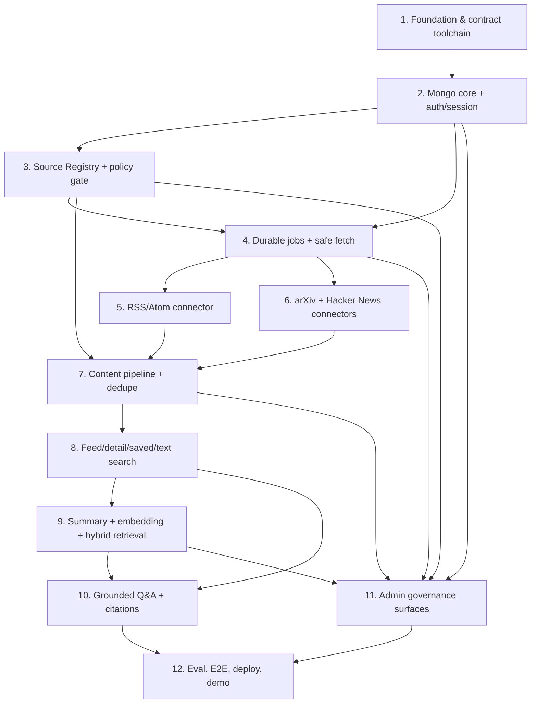

# TechPulse AI — 4-Week MVP Construction Blueprint

> Trạng thái: Ready v1.2 — language/media decisions reconciled  
> Phiên bản: 1.2  
> Cập nhật: 08/08/2026  
> Objective: xây MVP TechPulse AI end-to-end trong 4 tuần với scope đủ cho một người thực hiện  
> Execution mode: direct mode — git có sẵn trên `main`, chưa có remote và GitHub CLI  
> Implementation baseline: JavaScript/JSX (`.js`, `.jsx`) cho React/Node.js; không dùng TypeScript/TSX trong MVP  
> Canonical product contract: [../PRD.md](../PRD.md)  
> Canonical HTTP contract: [../contracts/openapi.json](../contracts/openapi.json)

## 1. Outcome

Sau Step 12, một user có thể đăng nhập, xem feed từ RSS/Atom + arXiv + Hacker News, thấy ảnh preview được duyệt hoặc visual fallback, mở link video quan trọng, đọc summary tiếng Việt, tìm kiếm text/hybrid và hỏi AI với citation cấp đoạn. Một admin có thể quản lý source/text/media policy, theo dõi/retry job, xử lý article/index, takedown và user mà không truy cập secret. Hệ thống deploy được trên Vercel, lưu state trong MongoDB và fail-closed khi quyền hoặc evidence không đủ.

Kế hoạch không thay đổi phạm vi trong [../PRD.md](../PRD.md). Nếu execution cho thấy bốn tuần không đủ, phải dùng plan mutation protocol và cập nhật product contract; không âm thầm bỏ security, source policy, citation hoặc ba connector.

## 2. Plan of record

Fresh agent bắt đầu bất kỳ step nào phải đọc theo thứ tự:

1. step tương ứng trong file này;
2. [../PRD.md](../PRD.md) cho requirement ID và acceptance gate;
3. [../TECHNICAL-DESIGN.md](../TECHNICAL-DESIGN.md) cho boundary/invariant;
4. [../DATA-MODEL.md](../DATA-MODEL.md) nếu step có persistence;
5. [../API-CONTRACT.md](../API-CONTRACT.md) và canonical OpenAPI nếu step chạm HTTP;
6. ADR liên quan trong [../adr/README.md](../adr/README.md).

Không dùng `TechPulse-AI.md` để ghi đè contract mới hơn; file đó là source quyết định/rationale gốc. Thứ tự authority:

```text
Product intent: PRD → Product Brief → TechPulse idea log
HTTP shape: OpenAPI
Persistence shape: DATA-MODEL
Architecture rationale: ADR
Execution order: blueprint này
```

## 3. Pre-flight evidence

| Check | Kết quả 08/08/2026 | Hệ quả |
|---|---|---|
| Git repository | Có, branch `main` | Có thể review diff/commit cục bộ |
| Git remote | Không có | Không lập kế hoạch dựa vào PR automation |
| GitHub CLI | Không cài | Direct mode; không dùng `gh` |
| Existing code/package | Chưa có | Step 1 sở hữu toàn bộ scaffold |
| Existing plan/memory | Không có | File này là execution index đầu tiên |
| ECC plugin marker | Có | Orchestration guide dùng `/ecc:orchestrate` và `ecc:*` |
| Language marker | Đã chốt | JavaScript/JSX theo ADR-0008; Step 1 tạo `.js`/`.jsx` và `jsconfig.json` |

JavaScript/JSX là quyết định đã duyệt, không còn là assumption. Đổi sang TypeScript/TSX sau này phải tạo ADR/plan mutation và migration plan riêng; không trộn hai baseline âm thầm.

## 4. Global invariants

Mọi step phải giữ các invariant sau:

1. Chỉ article `published` từ source hiện `active` và license `permitted|metadata-only` xuất hiện ở user surface/retrieval.
2. Mọi AI input đi qua current source policy; `metadata-only` không tự nâng scope.
3. Không persist/log raw HTML, full text, token, API key, password hoặc session token rõ.
4. External content là untrusted data; provider không nhận tool và không quyết định citation URL.
5. Job/provider side effect idempotent; state bền vững không nằm trong process memory.
6. Text search/feed/detail vẫn hoạt động khi embedding hoặc LLM provider lỗi.
7. Query/document vector chỉ so khi cùng model/dimensions/version.
8. Admin role và object ownership kiểm tra server-side; mọi admin mutation có audit.
9. HTTP implementation, generated JavaScript client/JSDoc và mock cùng dựa canonical OpenAPI.
10. Media nguồn chỉ là metadata/URL theo current `mediaPolicy`; không persist/rehost binary và media `not-analyzed` không vào AI evidence.
11. Không thêm connector, commercial feature, full-text archive hoặc claim-level citation.

## 5. Definition of Done cho mỗi step

Một step chỉ `done` khi:

- task và acceptance criteria của step đạt;
- test mới chứng minh happy path và failure/invariant path;
- `npm run contract:validate`, contract generation/test, lint và test liên quan không lỗi sau khi các script đó tồn tại;
- serialized response không dùng undocumented field;
- mọi HTTP operation bị thay đổi có success/error fixture và serialized response validate bằng canonical OpenAPI ngay trong step sở hữu, không chờ release gate;
- diff không sửa file ngoài ownership nếu không ghi lý do;
- tài liệu/runbook có ảnh hưởng được cập nhật;
- không còn secret/test credential hoặc generated file ngoài output path dự kiến;
- handoff ghi evidence thực, known limitation và next-step dependency.

## 6. Dependency graph



Parallel opportunities:

- Step 5 và Step 6 có thể chạy song song sau Step 4 vì sở hữu connector/fixture riêng; Step 7 là integration gate.
- Sau Step 9, phần UI/admin không chạm Q&A có thể tiến song song với Step 10 nếu ownership file rõ.
- Trong solo mode, vẫn thực hiện tuần tự để giảm context switching; DAG chỉ giúp biết phần nào không phụ thuộc logic.

Critical path dự kiến: `1 → 2 → 3 → 4 → 5/6 → 7 → 8 → 9 → 10 → 12`.

## 7. Four-week schedule

Đây là lịch timebox rất chặt cho solo execution, không phải cam kết rằng toàn bộ scope chắc chắn vừa 20 ngày. Nó chỉ khả thi khi giữ đúng non-goals, dùng generated JavaScript contract artifacts/fixtures và chạy verification song song với development. Nếu gate trượt hơn một ngày, kích hoạt mutation review ngay; không dồn nợ sang Week 4.

| Tuần | Build timebox | Verification/deploy lane chạy cùng tuần | Gate cuối tuần |
|---|---|---|---|
| 1 | Steps 1–3 | Contract/runtime fixtures từ operation đầu tiên; auth/security integration | Login/RBAC + source draft/policy hoạt động |
| 2 | Step 4, Steps 5–6, bắt đầu Step 7 | Staging/local production build; duplicate/lease/SSRF suite; E2E skeleton | Ba connector chạy qua durable runner; common pipeline đã ingest fixture |
| 3 | Hoàn tất 7, Steps 8–9, bắt đầu backend Step 11 | Deploy staging sớm; retrieval eval seed; user-flow browser smoke | User content vertical slice + summary/embedding/text fallback |
| 4 | Step 10, hoàn tất 11, Step 12 final gate | Citation/refusal eval, security matrix, public deploy và runbook | Q&A + admin minimum + evidence; giữ một ngày contingency |

Step 12 không đợi đến Week 4 mới bắt đầu: contract evidence có từ Week 1, staging/E2E từ Week 2 và retrieval eval từ Week 3. Step 12 chỉ hợp nhất release evidence, chạy full matrix và quyết định go/no-go.

Hard cutline:

- cuối Day 5: Steps 1–3 phải xanh; nếu chưa, không thêm UI polish;
- cuối Day 10: Step 4–6 và core Step 7 phải có fixture end-to-end;
- cuối Day 15: Step 8 cùng non-streaming summary/text fallback phải demo được;
- Day 16–18: Q&A vertical slice và admin operations tối thiểu;
- Day 19 dành release gate, Day 20 là contingency/local fallback.

Nếu Day 15 chưa đạt, project owner phải chọn một PRD mutation có ghi nhận; không được âm thầm bỏ source policy, ba connector, text fallback, citation/refusal hoặc backend admin authorization.

---

<a id="step-1"></a>
## Step 1 — Scaffold application and contract toolchain

**Intent:** Tạo một JavaScript/JSX modular-monolith skeleton có React/Vite, Express, test/lint/build và OpenAPI validation/JavaScript client generation. Đây là foundation duy nhất mà mọi step sau phụ thuộc.

**Dependencies:** Không có.  
**Estimate:** Timebox 1–1.5 ngày.  
**Review tier:** Architecture/contract-sensitive.  
**Primary requirements:** NFR-007, NFR-008, NFR-009 và PRD §10 MVP Deployment gate.  
**ADRs:** 0001, 0004, 0008.

### Cold-start context

Repo hiện chỉ có docs. Architecture yêu cầu một Vercel project với static Vite build và thin `api/index.js` import cùng Express app dùng local. OpenAPI JSON đã tồn tại và là authority; generator không được network/secret access hoặc ghi ngoài `shared/generated/`.

### Ownership/output

```text
package.json, package-lock.json, jsconfig.json, vite.config.*
client/**/*.jsx, client/**/*.js, server/app.js, server/dev.js, api/index.js
shared/generated/**, scripts/contracts/**
eslint/prettier/vitest config, vercel.json, .env.example
```

### Tasks

1. Scaffold React/Vite bằng JavaScript/JSX và Express composition root bằng JavaScript; giữ entrypoint production mỏng và không tạo `.ts`/`.tsx`.
2. Pin Node/package-manager version và dependency versions; thêm `.env.example` chỉ có tên biến.
3. Cài validation OpenAPI 3.1 và generator cho `api-client.js`/`api-schema.js` có JSDoc/runtime schema; reject remote/path-traversal `$ref`.
4. Thêm scripts `contract:validate`, `contract:generate`, `contract:test`, `lint`, `test`, `build`.
5. Implement `GET /api/v1/health` đúng contract, request ID middleware và centralized error envelope tối thiểu.
6. Thêm test contract cho health success/error và test generated output không drift.
7. Document local start/build và Vercel entrypoint.

### Verification

```text
npm ci
npm run contract:validate
npm run contract:generate
npm run contract:test
npm run lint
npm test -- --run
npm run build
```

### Exit criteria

- Clean checkout cài/build/test được bằng commands đã ghi.
- Health response validate với OpenAPI; generated JavaScript client/schema import được ở client/server.
- Client bundle không chứa server environment variable.
- Vercel/local import cùng `server/app.js`, không duplicate Express app.

### Rollback

Revert toàn bộ scaffold như một change set; docs/contract không bị xóa. Không rollback bằng cách đưa TypeScript/TSX vào riêng một phần codebase.

**Out of scope:** Database, authentication, business UI, connector hoặc provider thật.

---

<a id="step-2"></a>
## Step 2 — Build MongoDB core, authentication and session authorization

**Intent:** Thiết lập persistence/index migration, account lifecycle, opaque server-side session, CSRF và RBAC để user/admin surface có security boundary thật.

**Dependencies:** Step 1.  
**Estimate:** Timebox 2 ngày.  
**Review tier:** Security-critical.  
**Primary requirements:** AUTH-001..006, USER-001, ADMIN-005..007, NFR-006/009.  
**ADRs:** 0002, 0004.

### Cold-start context

Public registration không nhận role; admin đầu tiên do seed script tạo. Cookie chứa opaque token, Mongo chỉ lưu hash; CSRF header bắt buộc cho session mutation. Suspend/deletion tăng session version hoặc revoke mọi session. Admin không được đọc private chat/password/session/token.

### Ownership/output

```text
server/config/**, server/repositories/mongo/**
server/domain/user/**, server/application/auth/**, server/http/auth/**
server/http/middleware/{session,csrf,require-role}.js
scripts/migrations/**, scripts/seed-admin.*
client/features/auth/**, client/features/account/**
tests/integration/{mongo,auth,authorization}/**
```

### Tasks

1. Implement validated environment config và reusable Mongo connection phù hợp serverless.
2. Tạo idempotent migrations/indexes cho `users`, `sessions`, `rateLimitBuckets`, `savedArticles`, `adminAuditLogs` foundation.
3. Implement register/login/logout/current-user/preferences/account-deletion theo OpenAPI.
4. Hash password và opaque session token; TTL/revocation/session-version checks.
5. Implement CSRF + Origin check, role middleware, centralized `401/403` behavior và atomic Mongo-backed `rateLimitBuckets` cho login/shared quota; không dùng per-process counter.
6. Seed admin bằng explicit deployment script; không có role mutation API.
7. Tạo React auth/account state không lưu token trong `localStorage`.
8. Viết integration tests cho role injection, invalid/expired/revoked session, CSRF, suspended user và cross-user access.
9. Validate serialized success/error responses của auth/account operations bằng OpenAPI fixtures.

### Verification

```text
npm run contract:validate
npm run contract:test -- auth account
npm run lint
npm test -- --run auth
npm run test:integration -- auth authorization mongo
```

### Exit criteria

- Login → cookie session → `/me` hoạt động; logout/suspend làm request kế tiếp `401`.
- User nhận `403` ở admin probe; unauthenticated nhận `401`.
- Database/log scan không có password/token/session rõ.
- Seed admin idempotent và không in credential.

### Rollback

Revert auth routes/repositories và drop chỉ indexes/seed data do migration step này tạo trên demo database bằng documented rollback; không xóa database khác.

**Out of scope:** Source Registry, content, social login, password reset, MFA, multi-admin RBAC.

---

<a id="step-3"></a>
## Step 3 — Implement Source Registry and executable rights policy

**Intent:** Cho admin khai báo nguồn/publisher/evidence/scope, review quyền và activate/pause theo state machine; tạo policy gate dùng chung trước mọi AI/storage action.

**Dependencies:** Step 2.  
**Estimate:** Timebox 1.5 ngày.  
**Review tier:** Policy/security-sensitive.  
**Primary requirements:** SRC-001, SRC-003..009, ADMIN-006..008, NFR-010/011.  
**ADRs:** 0006, 0009.

### Cold-start context

Technical check sẽ hoàn thiện ở Step 4 nhưng source CRUD/review/policy invariant phải tồn tại trước. Không rõ quyền mặc định `metadata-only`; media mặc định `none`; `review-needed|blocked` không active/ingest. Text rights, media display và operational state độc lập. AI có thể hỗ trợ đọc Terms trong tương lai nhưng không phê duyệt.

### Ownership/output

```text
server/domain/source/**, server/application/sources/**
server/repositories/mongo/source-repository.*
server/http/admin/sources/**, server/domain/policy/**
client/features/admin/sources/**
scripts/seed-sources.*
tests/{unit,integration}/sources/**
```

### Tasks

1. Implement source schema/index/state transition và connector-config discriminated validation.
2. Implement admin list/create/read/update và policy-review operations đúng OpenAPI.
3. Implement pure content/media policy gates trả allowed fields/mode/host hoặc structured rejection; connector/provider không được tự nâng scope.
4. Enforce activation prerequisites, policyVersion increment và fail-closed current-policy lookup.
5. Ghi audit allowlisted before/after/reason cho mọi mutation.
6. Xây admin Sources UI cho draft/config/review/activate/pause, không hiển thị credential.
7. Seed source definitions ở `draft`; không seed `permitted` nếu chưa có evidence.
8. Test mọi state transition và matrix `licenseStatus × llmInputScope × storageScope`, cùng `imageMode/videoMode × allowedHosts`.
9. Validate serialized success/error responses của Source Registry operations bằng OpenAPI fixtures.

### Verification

```text
npm run contract:validate
npm run contract:test -- admin-sources
npm test -- --run source policy
npm run test:integration -- sources audit
```

### Exit criteria

- Source thiếu evidence không thể activate là permitted.
- `review-needed|blocked|none` bị policy gate chặn đúng purpose.
- Media policy mặc định tắt; mode/host không được duyệt không tạo `leadMedia`.
- Admin UI/API không expose secret và user luôn `403`.
- Mọi mutation tạo audit record đã redact.

### Rollback

Pause mọi source được tạo bởi step, revert route/UI, giữ evidence export cho audit. Không hard-delete source/article history như một rollback kỹ thuật.

**Out of scope:** Network fetch/technical check thật, ingestion job, automatic license interpretation.

---

<a id="step-4"></a>
## Step 4 — Add durable jobs, Mongo leases and SSRF-safe source fetching

**Intent:** Xây execution substrate dùng chung cho cron/admin: job idempotent, lease/checkpoint/retry và bounded network fetch; hoàn tất source technical check.

**Dependencies:** Steps 2–3.  
**Estimate:** Timebox 2 ngày.  
**Review tier:** Architecture/security-critical.  
**Primary requirements:** SRC-002/007, ING-002..006/009, ADMIN-002, NFR-001/005/006.  
**ADRs:** 0001, 0002, 0003, 0006.

### Cold-start context

Vercel không giữ process/queue memory. Cron và admin trigger phải gọi cùng service. Lease acquisition dùng atomic condition và expiry check; TTL chỉ cleanup. URL admin nhập vẫn untrusted: validate protocol, DNS/IP, mỗi redirect, timeout, size và content type.

### Ownership/output

```text
server/domain/jobs/**, server/application/jobs/**, server/jobs/**
server/repositories/mongo/{job,lease}-repository.*
server/infrastructure/http/safe-fetch.*
server/http/admin/ingestion-jobs/**
server/http/internal/cron/**, server/http/admin/source-technical-checks/**
client/features/admin/jobs/**
tests/{unit,integration}/jobs/**, tests/security/ssrf/**
```

### Tasks

1. Implement generic runner/lease primitives và `ingestionJobs` schema/index; Step 9 sở hữu `indexingJobs` schema/migration.
2. Implement atomic lease acquire/heartbeat/release with owner token, expiry và recovery.
3. Implement idempotency key behavior cho cron/manual/retry; retry tạo linked attempt mới.
4. Implement bounded runner với deadline margin, checkpoint, counters, cooperative cancellation và safe error redaction.
5. Implement SSRF-safe fetch adapter và bounded technical check; không lưu sample body.
6. Implement protected daily cron operation và admin job operations đúng OpenAPI; áp Mongo-backed rate-limit scope cho admin trigger/source test.
7. Xây minimal job list/detail/retry/cancel UI.
8. Test duplicate invocation, concurrent lease, expired worker, partial resume, non-retryable policy error, redirect-to-private-IP và oversized response.
9. Validate serialized success/error responses của cron/source-check/job operations bằng OpenAPI fixtures.

### Verification

```text
npm run contract:validate
npm run contract:test -- source-check ingestion-jobs cron
npm test -- --run jobs safe-fetch
npm run test:integration -- jobs leases cron
npm run test:security -- ssrf
```

### Exit criteria

- Hai invocation cùng idempotency key trả cùng logical job và không double side effect.
- Chỉ một worker giữ lease; expired lease recover an toàn.
- Technical check không thể truy cập localhost/private/link-local qua direct hoặc redirect URL.
- Cron dùng bearer riêng; admin cookie không gọi internal route và ngược lại.

### Rollback

Disable cron route/config trước, pause sources, chờ/recover running leases, rồi revert worker code. Giữ job/audit records để chẩn đoán.

**Out of scope:** Connector parse và article persistence.

---

<a id="step-5"></a>
## Step 5 — Implement the RSS/Atom connector

**Intent:** Parse nhiều RSS/Atom feed allowlisted qua common connector interface, giữ provenance và trả normalized candidates mà không tự fetch linked full article.

**Dependencies:** Step 4.  
**Estimate:** Timebox 0.75–1 ngày.  
**Review tier:** Default implementation + JavaScript/code review.  
**Primary requirements:** ING-001/006/007/009, SRC-006/007/009, ART-007.  
**ADRs:** 0003, 0006, 0009.

### Cold-start context

RSS/Atom access không phải full-text/media license. Connector chỉ dùng field feed nằm trong source scope, áp timeout/size/rate limit, và coi markup/text/URL là untrusted. Nó có thể trả media candidate metadata từ field feed chính thức nhưng không download/probe binary, không tự quyết định quyền hiển thị và không gọi provider.

### Ownership/output

```text
server/connectors/rss/**
tests/fixtures/rss/**
tests/connectors/rss/**
```

Không sửa composition/registry chung ngoài một integration hook nhỏ đã định nghĩa ở Step 4; nếu chạy song song Step 6, Step 7 sở hữu final registry merge.

### Tasks

1. Implement connector interface for RSS 2.0/Atom với conditional metadata nếu feed hỗ trợ.
2. Normalize external ID, title, URL, author, date, language, official excerpt, retrieval timestamp và optional media candidate URL/type/alt/credit từ field feed đã allowlist.
3. Bound item count, payload size, redirects và parse errors; retry only mapped transient errors.
4. Preserve source/external provenance và distinguish missing field from empty field.
5. Add fixtures cho valid RSS/Atom, namespace variation, malformed XML, duplicate IDs, unsafe URL và missing dates.
6. Contract test output normalized candidate, không raw HTML/full article/media binary; media URL không HTTPS hoặc không thuộc field cho phép bị loại.

### Verification

```text
npm test -- --run connectors/rss
npm run lint
```

### Exit criteria

- RSS và Atom fixtures normalize cùng schema.
- Malformed/oversized feed fail có typed/redacted error, không crash batch.
- Connector không gọi LLM/embedding hoặc fetch article URL.
- Connector không fetch media URL; quyền/mode/host được policy gate ở Step 7 quyết định.

### Rollback

Unregister RSS connector và pause RSS sources; không sửa/xóa article đã ingest ngoài explicit cleanup script có dry-run.

**Out of scope:** Arbitrary webpage scraping, full-text extraction, feed discovery crawler, media download/proxy.

---

<a id="step-6"></a>
## Step 6 — Implement arXiv and Hacker News connectors

**Intent:** Dùng API chính thức để ingest arXiv query và ba Hacker News stream qua cùng candidate contract; gắn đúng authority/provenance semantics.

**Dependencies:** Step 4.  
**Estimate:** Timebox 1 ngày.  
**Review tier:** Default implementation + JavaScript/code review.  
**Primary requirements:** ING-001/006/007, ART-001, SRC-006/007.  
**ADRs:** 0003, 0006.

### Cold-start context

arXiv abstract/license ở cấp paper; full text không được suy diễn là allowed. Hacker News là `community-signal`; HN item/link không cấp quyền dùng linked article và không phải evidence duy nhất mặc định. Connector không fetch linked website.

### Ownership/output

```text
server/connectors/arxiv/**
server/connectors/hacker-news/**
tests/fixtures/{arxiv,hacker-news}/**
tests/connectors/{arxiv,hacker-news}/**
```

### Tasks

1. Implement arXiv query pagination/batch, rate etiquette, ID/version normalization, authors/date/abstract/license metadata.
2. Implement HN top/new/best stream item lookup với bounded concurrency, missing/deleted item handling và linked URL preservation.
3. Map arXiv authority theo source config; hard-code HN output tier không vượt `community-signal`.
4. Map timeout/429/5xx retryable; invalid payload/permanent missing item không retry vô hạn.
5. Add deterministic fixtures, provider-free tests và no-linked-page-fetch assertion.
6. Expose connector metrics/counters without storing response body.

### Verification

```text
npm test -- --run connectors/arxiv connectors/hacker-news
npm run lint
```

### Exit criteria

- Ba query arXiv và top/new/best stream cấu hình được không đổi core logic.
- HN candidate luôn `community-signal` và không tự biến linked site thành permitted source.
- Connector output cùng normalized candidate contract với RSS.

### Rollback

Unregister failing connector và pause source definitions tương ứng; connectors độc lập nên rollback không ảnh hưởng RSS.

**Out of scope:** arXiv PDF parsing, HN comment ingestion, linked-site scraping.

---

<a id="step-7"></a>
## Step 7 — Integrate normalization, deduplication and article lifecycle

**Intent:** Nối ba connector vào pipeline article idempotent, canonicalize/dedupe/provenance và publish/review state đúng policy.

**Dependencies:** Steps 3–6.  
**Estimate:** Timebox 1.5–2 ngày.  
**Review tier:** Architecture/data-integrity review.  
**Primary requirements:** ING-001/003/004/007/008, ART-001/002/005..007, SRC-009, NFR-001/011.  
**ADRs:** 0002, 0003, 0006, 0009.

### Cold-start context

Connector output là candidate, không phải article trusted. Dedupe chắc chắn bằng source/external ID/canonical URL/hash; near-title/semantic ambiguity phải `review-needed`, không auto-merge. Rights/media snapshot phục vụ audit nhưng current source state/policy mới quyết định visibility. Media candidate chỉ là URL metadata và tuyệt đối không phải evidence đã phân tích.

### Ownership/output

```text
server/domain/article/**, server/application/ingestion/**
server/repositories/mongo/article-repository.*
server/connectors/registry.*
scripts/migrations/*article*
tests/{unit,integration}/articles/**, tests/integration/ingestion/**
```

### Tasks

1. Implement normalized candidate → article mapper, URL/time/language/topic normalization, allowed excerpt sanitization và media policy gate cho optional `leadMedia`.
2. Create article indexes/validators và shared current-source visibility predicate.
3. Implement layered dedupe, stable dedupe key, union provenance và ambiguous review flow.
4. Integrate connector runner → upsert → counters/checkpoint without duplicate side effect.
5. Set summary/embedding pending states, rights/media policy snapshot/version and publish/review decision; không fetch/persist media binary.
6. Implement hide/restore/merge domain operations and visibility reconciliation jobs.
7. Test rerun same batch, cross-source canonical duplicate, conflicting metadata, source blocked mid-run, allowed/blocked media host/mode và crash-before-checkpoint recovery.

### Verification

```text
npm test -- --run article dedupe normalization
npm run test:integration -- ingestion visibility idempotency
```

### Exit criteria

- Cả ba fixture connector đi qua common pipeline vào MongoDB.
- Re-run không tăng logical article/save/provenance sai.
- Chỉ valid article published; ambiguous case vào review.
- Source policy đổi fail-closed ở query/pipeline dù reconciliation chưa xong.
- `leadMedia` chỉ giữ HTTPS metadata đã qua current policy; video luôn link-only và `not-analyzed`; database không có binary/base64.

### Rollback

Pause production source và disable runner trước. Revert mapper/repository; dùng dry-run cleanup theo `jobId/sourceId` nếu dữ liệu demo do bug tạo, không broad-delete collection.

**Out of scope:** AI summary, embedding, user feed UI.

---

<a id="step-8"></a>
## Step 8 — Deliver feed, detail, saved articles and keyword search

**Intent:** Hoàn thành user content vertical slice dùng được khi mọi AI provider tắt: feed/filter/detail/original source/saved/text search.

**Dependencies:** Steps 2 and 7.  
**Estimate:** Timebox 1.5 ngày.  
**Review tier:** Product/frontend + authorization review.  
**Primary requirements:** USER-002..004, ART-002..004/007, SEARCH-001/002/006, AI-006/007, NFR-002/007/011.  
**ADRs:** 0004, 0005, 0009.

### Cold-start context

User query luôn lọc article/source visibility. Cursor dựa `(publishedAt,id)` và opaque với client. Detail không hiển thị full article; `leadMedia` nullable chỉ được serialize theo current media policy. Ảnh dùng remote-preview/fallback, video link-only với disclosure AI chưa phân tích. CTA nguồn nổi bật và summary có thể pending/null. Saved relation thuộc user và operation idempotent.

### Ownership/output

```text
server/application/{articles,search,saved}/**
server/http/{articles,search,saved}/**
client/features/{feed,article-detail,saved,search}/**
client/components/citation/**
tests/{integration,ui}/content/**
```

### Tasks

1. Implement article list/detail, saved list/save/unsave/clear và text search operations đúng OpenAPI.
2. Apply shared visibility/ownership predicate ở mọi query, kể cả saved result.
3. Build responsive accessible feed/filter/search/detail/saved UI bằng generated JavaScript client/JSDoc contract.
4. Render original title/source/date/language/summary basis/AI label và prominent original-link CTA.
5. Render allowed image remote-preview với alt/credit/lazy loading; render TechPulse-owned fallback khi null/error; video chỉ là source link với `AI chưa phân tích video này`.
6. Handle empty/loading/error/pending-summary/unavailable-saved states.
7. Add cursor consistency, no-leak, cross-user authorization, media-policy/fallback và keyboard/focus tests.
8. Validate serialized success/error/empty/media-null responses của article/search/saved operations bằng OpenAPI fixtures.

### Verification

```text
npm run contract:validate
npm run contract:test -- articles search saved
npm test -- --run content search saved
npm run test:integration -- visibility ownership pagination
npm run test:ui -- feed detail search saved
```

### Exit criteria

- User hoàn thành login → feed → filter/search → detail → original source.
- Text search hoạt động khi embedding/LLM adapter bị disable.
- Hidden/removed/review article hoặc blocked source không leak qua feed/detail/search/saved.
- Media ngoài policy không được serialize; image failure dùng fallback, video không render iframe/player và mang `not-analyzed`.
- Core flow keyboard/focus/label cơ bản đạt.

### Rollback

Revert user routes/UI theo module; article data/pipeline giữ nguyên. Nếu cursor bug, tạm hạ limit nhưng không đổi response contract âm thầm.

**Out of scope:** Semantic ranking, AI Q&A, personalization/recommendation.

---

<a id="step-9"></a>
## Step 9 — Add Vietnamese summaries, embeddings and hybrid retrieval

**Intent:** Tạo generated summary/title tiếng Việt và BGE-M3 vectors từ allowed fields, có model/version/hash, fallback text và admin retry/index state.

**Dependencies:** Steps 3, 4, 7 and 8.  
**Estimate:** Timebox 2 ngày.  
**Review tier:** AI/policy/data-integrity review.  
**Primary requirements:** SEARCH-003..006, AI-001..005/007, ADMIN-003, NFR-003/005/008/009/011.  
**ADRs:** 0005, 0006, 0007, 0008, 0009.

### Cold-start context

LLM primary/fallback chỉ đổi qua server config; fallback chỉ lỗi retryable. Embedding pin `baai/bge-m3`, 1024 dimensions và version; không runtime-switch vector model. `fulltext-temporary` nếu hợp lệ được safe-fetch/extract/chunk trong memory rồi discard. Provider input/log không có field ngoài scope và luôn loại `leadMedia`/media URL/alt khỏi evidence vì media MVP là `not-analyzed`.

### Ownership/output

```text
server/providers/{llm,embedding}/**
server/application/{summaries,embeddings,retrieval}/**
server/domain/ai-policy/**
server/jobs/indexing/**
scripts/migrations/*indexing-jobs*
client/features/article-detail/summary-state.*
tests/{unit,integration,eval}/ai/**
```

### Tasks

1. Implement `indexingJobs` schema/migration trên generic runner từ Step 4.
2. Implement JavaScript LLM/embedding ports với JSDoc, runtime output schemas, configured adapters, timeout/error mapping và fake adapters.
3. Build policy-derived summary/embedding inputs; sanitize/delimit external data, loại media fields và disable tools.
4. Validate structured summary output, length/novel wording, Vietnamese label, model/basis/hash/status.
5. Validate embedding length/model/version/hash; cache unchanged input và enqueue re-index on change.
6. Implement candidate filter + cosine + hybrid ranking; record effective mode/fallback reason.
7. Implement bounded summary/index job and admin retry hooks.
8. Create small Vietnamese retrieval benchmark; do not fix version 1 until top-5 gate passes.
9. Test provider outage, primary→fallback, policy rejection no-fallback, media exclusion, dimension mismatch, temporary-text disposal và log redaction.
10. Validate serialized search fallback/hybrid và admin indexing responses bằng OpenAPI fixtures.

### Verification

```text
npm run contract:validate
npm run contract:test -- search indexing
npm test -- --run ai-policy providers summary embedding retrieval
npm run test:integration -- indexing text-fallback
npm run eval:retrieval
```

### Exit criteria

- Allowed article có summaryVi ngắn và embedding metadata đầy đủ; forbidden scope không gọi provider.
- Provider lỗi không phá feed/text search.
- Query/document version mismatch không tính cosine.
- Retrieval benchmark đưa relevant evidence vào top 5 theo gate đã chốt.
- Memory/log/database scan không có temporary full text.
- Summary/embedding input không chứa media URL/alt/binary và không claim chi tiết chỉ có trong media.

### Rollback

Disable provider config và hybrid mode; text search/UI content tiếp tục hoạt động. Mark vectors của faulty version invalid/removed và re-index có kiểm soát, không trộn version.

**Out of scope:** Claim-level citation, model fine-tuning, Atlas Vector Search, arbitrary admin model picker.

---

<a id="step-10"></a>
## Step 10 — Implement grounded Q&A, paragraph citations and refusal

**Intent:** Trả lời tiếng Việt chỉ từ retrieved evidence, gắn citation cấp đoạn, biểu diễn mâu thuẫn và từ chối khi thiếu bằng chứng.

**Dependencies:** Steps 8–9.  
**Estimate:** Timebox 2 ngày.  
**Review tier:** AI safety/security-critical.  
**Primary requirements:** QA-001..008, USER-004, AI-007, NFR-003/005/009/011.  
**ADRs:** 0005, 0006, 0007, 0009.

### Cold-start context

Model không tạo URL. Server gán stable evidence ID, validate cited IDs và hydrate citation từ MongoDB. External text nằm trong delimited data; provider không có tool. `leadMedia` có `not-analyzed` không vào evidence block. Answer factual paragraph cần citation; insufficient/blocked/provider-unavailable có refusal code rõ.

### Ownership/output

```text
server/application/qa/**, server/domain/citations/**
server/http/answers/**, server/repositories/mongo/chat-repository.*
client/features/qa/**
tests/{unit,integration,eval}/qa/**
```

### Tasks

1. Implement question/scope validation, Mongo-backed minute/daily quota buckets và visible evidence retrieval.
2. Build prompt/evidence envelope chống prompt injection; no tools/model URL.
3. Parse structured answer paragraphs + evidence IDs; validate ID existence, visibility và citation coverage.
4. Handle conflict presentation, bounded repair attempt và deterministic refusal path.
5. Persist minimal user-owned chat/answer/citation history; implement list/delete/clear endpoints.
6. Build Q&A UI với loading, paragraphs, citation drawer/link, refusal/conflict states.
7. Build evaluation set gồm grounded, insufficient, conflicting, hidden-source, media-only claim và injected-instruction cases.
8. Test primary/fallback and non-streaming baseline; streaming chỉ thêm nếu baseline ổn định mà không đổi semantic contract.
9. Validate answered/refused/rate-limited/error serialized responses bằng OpenAPI fixtures.

### Verification

```text
npm run contract:validate
npm run contract:test -- answers chat-sessions
npm test -- --run qa citations prompt-injection
npm run test:integration -- answers chat-ownership hidden-evidence
npm run eval:groundedness
npm run eval:citations
```

### Exit criteria

- Mỗi answered factual paragraph có citation ID hợp lệ/hydrated; precision mục tiêu ≥90% trên eval set.
- Không đủ evidence tạo refusal, không dùng model memory để lấp chỗ trống.
- Hidden/removed/review/blocked content không vào prompt/citation.
- Câu hỏi chỉ có câu trả lời trong ảnh/video chưa xử lý phải refuse hoặc nói không đủ bằng chứng, không suy diễn từ metadata.
- User xóa được chat của mình; cross-user read/delete bị chặn.

### Rollback

Feature-flag Q&A off và giữ feed/search/citations bài gốc. Xóa/anonymize test chat theo policy; không rollback bằng cách bật ungrounded chatbot.

**Out of scope:** Tool-using agent, web browsing at question time, claim-level citations, multilingual output ngoài tiếng Việt.

---

<a id="step-11"></a>
## Step 11 — Complete admin operations, governance and audit UI

**Intent:** Ghép các backend capability thành dashboard vận hành tối thiểu: overview, jobs, articles/index, takedown, users và immutable audit view.

**Dependencies:** Steps 2–4, 7 and 9. Có thể hoàn tất song song Step 10 nếu file ownership tách.  
**Estimate:** Timebox 1.5–2 ngày; backend operations phần lớn đã hình thành ở Steps 2–9.  
**Review tier:** Security/governance review.  
**Primary requirements:** ADMIN-001..008, ART-005..007, AUTH-005/006, SRC-009, NFR-011.  
**ADRs:** 0002, 0003, 0004, 0006, 0009.

### Cold-start context

Admin xử lý ngoại lệ, không duyệt từng article. Dangerous mutation yêu cầu confirm + reason và audit. Hide/blocked/takedown phải fail-closed trước cleanup; hard delete chỉ theo approved scope. Admin không xem private chat, password hash, session/token/provider secret.

### Ownership/output

```text
server/application/admin/**, server/application/takedowns/**
server/http/admin/{overview,articles,takedowns,users,audit}/**
client/features/admin/{overview,articles,takedowns,users,audit}/**
tests/{integration,ui,security}/admin/**
```

### Tasks

1. Implement actionable overview counts và stale/failed indicators.
2. Complete admin article topic/status/merge/summary/index/media-preview operations với reconciliation; cho phép ẩn media riêng.
3. Implement takedown lifecycle: hide first, cleanup approved metadata/media-reference/summary/vector scope, verify, complete.
4. Implement minimal user list/detail/suspend/restore; suspend revokes sessions.
5. Implement read-only audit list; no update/delete operation, snapshots allowlist/redact.
6. Build dashboard navigation/states/confirm-reason dialogs và error handling.
7. Add `401/403`, CSRF, dangerous transition, media-policy/host, secret-redaction và failure-audit tests cho mọi admin group.
8. Run one end-to-end takedown and one user suspend/restore scenario on seeded data.
9. Validate serialized success/error/empty responses của mọi admin operation bằng OpenAPI fixtures.

### Verification

```text
npm run contract:validate
npm run contract:test -- admin
npm test -- --run admin takedown audit
npm run test:integration -- admin-authorization reconciliation session-revocation
npm run test:ui -- admin
npm run test:security -- admin-redaction
```

### Exit criteria

- User không gọi được bất kỳ admin operation nào; admin mutation có reason/audit.
- Takedown completed loại đúng metadata/media-reference/summary/vector scope và không còn user/retrieval leak.
- Suspend user làm session hiện tại mất hiệu lực.
- Dashboard không render field cấm hoặc stack trace/secret.
- Admin đổi media policy làm media vi phạm biến mất khỏi user API mà không cần ẩn cả bài; action có reason/audit.

### Rollback

Disable admin mutation routes/UI ngoài source pause emergency, giữ read-only overview/audit. Không undo takedown đã hoàn tất nếu chưa có legal review; phục hồi chỉ qua explicit approved transition.

**Out of scope:** Superadmin, MFA, SSO, multi-approver workflow, prompt/model editor.

---

<a id="step-12"></a>
## Step 12 — Run adversarial verification, deploy and prepare the demo

**Intent:** Chứng minh toàn bộ acceptance gates bằng contract/integration/E2E/eval/security evidence, deploy Vercel và tạo runbook/demo fallback có thể lặp lại.

**Dependencies:** Steps 1–11.  
**Estimate:** Final gate 1.5 ngày; evidence harness/deploy smoke đã chạy dần từ Weeks 1–3.  
**Review tier:** Strongest adversarial system review.  
**Primary requirements:** Toàn bộ MVP acceptance gate và NFR-001..011.  
**ADRs:** Tất cả accepted ADR.

### Cold-start context

Demo target gồm 8–10 RSS/Atom feed có rights evidence, arXiv `cs.AI/cs.MA/cs.RO`, HN top/new/best, khoảng 250–400 article. Vercel URL tạm phục vụ chấm; local fallback bắt buộc. Free provider/quota phải kiểm tra sát ngày demo nhưng không hard-code assumption vào business logic.

### Ownership/output

```text
tests/e2e/**, tests/eval/**, tests/security/**
scripts/seed-demo.*, scripts/verify-demo.*
docs/DEMO-RUNBOOK.md, docs/TEST-EVIDENCE.md
deployment config và release evidence
```

### Tasks

1. Validate contract; run full unit/integration/UI/E2E suite và runtime response validation.
2. Run negative-invariant matrix: hidden/removed/review/blocked, role/object/CSRF, prompt injection, media mode/host/AI exclusion, duplicate cron, SSRF, secret/fulltext/binary-media scan.
3. Run retrieval/citation/refusal eval; record dataset, threshold, failures và model/version.
4. Complete evidence record cho exact demo sources; default unclear feed to metadata-only.
5. Seed deterministic admin/user/source/demo data without committed secret.
6. Deploy Vercel + Mongo Atlas config, verify cron/manual shared job, cold-start/degradation behavior và public URL.
7. Run browser E2E: user core path gồm approved image/fallback/video link-only, admin source/job/media-policy path, takedown path, provider outage/text fallback.
8. Create demo script, local fallback, troubleshooting, reset-safe seed và post-grading shutdown date.
9. Critical/high finding làm release gate thất bại; quay lại step/module owner hoặc tạo mutation step riêng, không biến Step 12 thành change set sửa nhiều module.

### Verification

```text
npm ci
npm run contract:validate
npm run contract:generate
npm run contract:test
npm run lint
npm test -- --run
npm run test:integration
npm run test:e2e
npm run test:security
npm run eval:retrieval
npm run eval:citations
npm run eval:groundedness
npm run build
```

### Exit criteria

- Mọi PRD gate có evidence/link/test; không chỉ ghi “đã test thủ công”.
- Citation precision ≥90%, relevant evidence top 5 và refusal cases không unsupported claim.
- Deployed user/admin/cron flows hoạt động; provider outage degrade đúng.
- Database/log/bundle scan không chứa secret/full text/binary hoặc base64 media nguồn.
- Demo và local fallback chạy được từ clean instructions; shutdown date ghi rõ.

### Rollback

Nếu deployment lỗi, giữ local fallback và revert deployment-only config về known-good build; không bypass auth/policy để cứu demo. Nếu source/provider policy không chắc, pause source/provider path và dùng deterministic permitted/metadata-only seed.

**Out of scope:** Production SLA, unrestricted public launch, commercial use, hậu-MVP connectors/features.

---

## 8. Dependency handoff contract

Mỗi step kết thúc bằng một handoff ghi:

```text
Step/status:
Changed files:
Contract/schema migrations:
Verification commands + actual result:
Invariant/negative tests added:
Known limitations:
Data/config required by next step:
Rollback note:
```

Step sau không dựa vào câu “works locally”; phải có command/evidence hoặc explicit blocker.

## 9. Adversarial review gate

Trước khi blueprint đổi sang `Ready`:

- reviewer độc lập kiểm tra completeness so với PRD;
- dependency edge và file ownership không tạo circular/hidden prerequisite;
- mỗi step đủ nhỏ cho một change set và fresh agent có thể cold-start;
- verification chứng minh output thay vì chỉ compile;
- rollback không xóa broad data;
- security/policy/citation không bị dồn hết vào cuối;
- Week 4 còn buffer thực tế;
- critical finding được sửa trong plan; non-critical finding có disposition.

Review record được ghi ở cuối file với reviewer findings/resolutions, không chỉ đổi status.

## 10. Plan mutation protocol

### Split

Khi step quá lớn, giữ ID gốc làm parent và tạo `Na`, `Nb`; dependency trỏ output cụ thể. Không đánh lại số step đã bắt đầu.

### Insert

Step mới dùng ID `N.1` giữa N và N+1, nêu blocker/risk tạo ra nó và cập nhật DAG/schedule/orchestration guide.

### Reorder

Chỉ reorder khi output dependency vẫn đúng; ghi old/new order và verification chứng minh không còn hidden prerequisite.

### Skip/de-scope

Không mark skipped chỉ vì hết thời gian. Ghi requirement/acceptance bị ảnh hưởng và project owner phê duyệt PRD change. Security, policy gate, citation/refusal và connector count không được silently de-scope.

### Abandon/rollback

Ghi state đã tạo, cleanup/visibility action và recoverability. Không broad-delete, reset hard hoặc xóa audit/source evidence.

### Contract/architecture change

1. Product intent đổi → cập nhật PRD.
2. Architecture choice đổi → tạo ADR mới/supersede ADR cũ sau approval.
3. HTTP boundary đổi → OpenAPI trước, regenerate JavaScript client/JSDoc/test sau.
4. Persistence đổi → DATA-MODEL + idempotent migration/rollback.
5. Cập nhật plan version, dependency graph và orchestration prompts.

## 11. Scope-pressure order

Nếu trượt lịch, ưu tiên giảm độ bóng chứ không giảm trust thesis:

1. bỏ animation/visual polish không cần thiết;
2. giảm số filter/admin convenience view nhưng giữ operation end-to-end;
3. dùng non-streaming Q&A ổn định;
4. giới hạn batch/corpus gần 250 thay vì 400;
5. giảm RSS demo về 8 thay vì 10, vẫn giữ ba connector;
6. ghi PRD change để hoãn optional chat-list polish nếu thật sự cần, nhưng vẫn bảo đảm user xóa dữ liệu đã lưu.

Không cắt source policy, admin backend authorization, idempotency/lease, text fallback, citation validation, refusal hoặc takedown visibility.

## 12. Plan change log

| Version | Date | Change | Reason/approval |
|---|---|---|---|
| 1.0 | 2026-08-08 | Initial 12-step blueprint | Derived from accepted product/architecture docs; pending adversarial review |
| 1.1 | 2026-08-08 | Resolve adversarial review findings | Reviewer found no critical blocker; project owner request authorized plan completion |
| 1.2 | 2026-08-08 | Lock JavaScript/JSX and policy-controlled external media | Project owner explicitly approved both decisions; ADR-0008/0009 |

## 13. Adversarial review record

Reviewer độc lập: `blueprint_adversarial_review` (read-only), 08/08/2026.

| Severity | Finding | Resolution in v1.1 |
|---|---|---|
| Critical | Không có blocker nghiêm trọng | Blueprint có thể chuyển `Ready` sau các sửa bên dưới |
| High | Lịch solo dồn Step 4–7 vào Week 2 và Step 10–12 vào Week 4 | Chuyển sang vertical-slice timebox, progressive verification/deploy, hard cutline Day 5/10/15 và Day 20 contingency |
| High | Step 9 thiếu dependency search module của Step 8 | Thêm `8 → 9` trong DAG, dependency và critical path |
| High | Runtime contract validation bị dồn đến Step 12 | Thêm vào global DoD, tạo `contract:test` từ Step 1 và bắt buộc fixtures ở mọi HTTP-owning step |
| Medium | Ownership `indexingJobs` trùng Step 4/9 | Step 4 chỉ sở hữu generic runner + `ingestionJobs`; Step 9 sở hữu `indexingJobs` schema/migration |
| Medium | Rate-limit không có shared persistence rõ | Thêm atomic Mongo-backed `rateLimitBuckets`; Step 2 tạo nền, Step 4/10 áp scope |
| Medium | Step 12 vừa verify vừa sửa critical/high | Step 12 trở thành go/no-go gate; finding quay về module owner hoặc mutation step |
| Low | “Deployment gate” chưa trace rõ | Đổi thành PRD §10 MVP Deployment gate |

Reviewer bổ sung cho v1.2: `blueprint_v12_adversarial_review`, 08/08/2026. Reviewer không báo critical/high blocker mới đối với baseline JavaScript/JSX hoặc policy-controlled media. Root revalidation xác nhận OpenAPI parse được, `LeadMedia`/`MediaPolicy` có required fields, không còn TypeScript-specific reviewer/build artifact như execution dependency, orchestration có 24 command, chain dài nhất là 4 và mọi prompt nằm trong giới hạn 200–600 ký tự. Quyết định media được trace qua PRD, Technical Design, Data Model, ADR-0009, blueprint Steps 3/5/7/8/9/10/11/12 và Orchestration Guide.

Residual risk: toàn bộ PRD vẫn tham vọng cho solo bốn tuần. `Ready` nghĩa plan đã có cutline và escalation rõ, không có nghĩa schedule chắc chắn; trượt hard gate bắt buộc product-owner mutation thay vì làm chất lượng/security suy giảm âm thầm.
